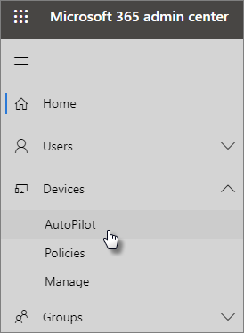

# AutoPilot cihaz ve profilleri eklemek için adım adım kılavuzu kullanın.

Windows AutoPilot Windows 10 u kullanarak  işletmenize uygun yeni cihaz ve cihazları çalışanlarınıza verirken kullanıma hazır hale kullanabilirsiniz.
  
## Cihaz gereksinimleri

Cihazlar şu gereksinimleri karşılamalıdır:
  
- Windows 10, sürüm 1703 veya sonrası
    
- Henüz ilk ve en son Windows yeni cihazlar
    
## Cihaz ve profil oluşturmak için kurulum kılavuzunu kullanma

Henüz cihaz grupları veya profil oluşturmadıysanız, başlamanın en iyi yolu adım adım kılavuzu kullanmaktır. Ayrıca, kılavuzu [kullanmadan](create-and-edit-autopilot-devices.md) [cihazlar ekleyebilir ve](create-and-edit-autopilot-profiles.md) onlara profil atabilirsiniz. 
  
1. yönetim merkezine <a href="https://go.microsoft.com/fwlink/p/?linkid=837890" target="_blank">https://admin.microsoft.com</a> gidin.

2. Sol gezinti bölmesinde Cihazlar  \> **AutoPilot'ı seçin.**

    
  
2. **AutoPilot sayfasında Kılavuzu** başlat'a tıklayın **veya dokunun.**
    
    
  
3. Cihaz **Upload .csv listesinin bulunduğu dosyada,** dosyanın hazır bulunduğu konuma gidin ve .CSV **Aç'ı** \> **seçin.** Dosyada üç üst bilgi olması gerekir:
    
    - A sütunu: Cihaz Seri Numarası
    
    - B sütunu: Windows Ürün Kimliği
    
    - C sütunu: Donanım Numarası
    
    Bu bilgileri donanım satıcıdan edinebilirsiniz veya CSV dosyası oluşturmak için [Get-WindowsAutoPilotInfo PowerShell](https://www.powershellgallery.com/packages/Get-WindowsAutoPilotInfo) betiği kullanabilirsiniz. 
    
    Daha fazla bilgi için bkz. [Cihaz listesi CSV dosyası](../admin/misc/device-list.md). **Cihaz listesiyle .csv dosyası yükleme** sayfasında bir örnek dosya da indirebilirsiniz. 
    
> [!NOTE]
> Bu betikte, müşterinin cihazı AutoPilot'a kaydetmesi için gereken özellikleri almak Windows kullanılır. Sonuçta elde edilen CSV dosyasının BIR Windows Ürün Kimliği (PKID) değeri toplamamalerinin normal olduğunu, çünkü bir cihazı kaydetmek için bu değerin gerekli olmadığını ve PKID'nin CSV çıktısinde NULL olması tamamen sorun olmadığını unutmayın. Yalnızca seri numarası ve donanım karması doldurulur.
    
4. Profil **atama sayfasında** mevcut bir profili seçebilirsiniz veya yeni bir profil oluşturabilirsiniz. Henüz bir tane yoksa, oluşturmak için bir hesap oluşturmanız istenir. 
    
    Profil, tek bir cihaza veya bir cihaz grubuna uygulanabilen ayarlar koleksiyonudur.
    
    Varsayılan özellikler gereklidir ve otomatik olarak ayarlanır. Varsayılan özellikler şunlardır:
    
    - OEM Cortana, OneDrive kaydı atlayabilirsiniz.
    
    - Şirketinizin markasıyla oturum açma deneyimi oluşturma.
    
    - Bağlan hesaplarınıza Azure Active Directory ve sizin tarafından yönetilleri için otomatik olarak Microsoft 365 İş Ekstra.
    
    Daha fazla bilgi için [bkz. AutoPilot Profili ayarları hakkında](autopilot-profile-settings.md). 
    
5. Diğer ayarlar, **Gizlilik ayarlarını atla** ve **Kullanıcının yerel yönetici olmasına izin verme** şeklindedir. Varsayılan olarak ikisi de **Kapalı** durumdadır. 
    
    **İleri**'yi seçin.
    
6. **Hepsi bu kadar,** oluşturduğunuz (veya seçtiğiniz) profilin, cihaz listesini yükerek oluşturduğunuz cihaz grubuna uygulanıyor olduğu gösterir. Ayarlar, cihaz kullanıcıları bir sonraki oturum açmada etkili olur. **Kapat**'ı seçin.

## İlgili içerik

[AutoPilot Profili ayarları hakkında](autopilot-profile-settings.md) (makale)\
[Cihazlarınızı ve uygulama verilerinizi koruma seçenekleri](../admin/devices/choose-device-security.md) (makale)
