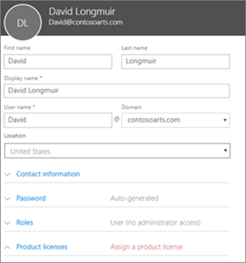
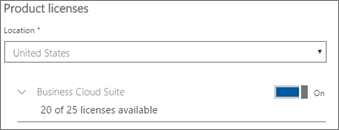

# Microsoft 365 Business'a daha fazla kullanıcı ekleme

## Yeni kullanıcı ekleme

Kullanıcı ekleme yle ilgili kısa bir video izleyin.   

> [!VIDEO https://www.microsoft.com/videoplayer/embed/RE1FOfN] 

Bu videoyu faydalı bulduysanız, [küçük işletmelere ve Microsoft 365’i ilk kez kullananlara yönelik eğitim serisinin tamamına göz atın](https://support.office.com/article/6ab4bbcd-79cf-4000-a0bd-d42ce4d12816).  

Kullanıcı eklemek için:

1. 'deki <a href="https://go.microsoft.com/fwlink/p/?linkid=837890" target="_blank">https://admin.microsoft.com</a>yönetici merkezine gidin. 
2. Sol gezinti bölmesinde, **Kullanıcıları** \> **Etkin kullanıcıları**seçin.
3. Etkin **kullanıcılar** **sayfasında, kullanıcı ekle'yi**seçin.
4. Yeni **kullanıcı** paneline gerekli bilgileri yazın. 
  
    **İletişim bilgileri**ne göre daha fazla bilgi girin, **Parola** ayarı altında parolayı nasıl ayarlayabileceğinizi seçin ve **Roller**altında roller atayabilirsiniz.
      
    
      
    Ürün lisansları bölümünde, **Microsoft 365 İş** ürün lisans ayarını **A.B.D.** olarak ayarlayın.
      
    
  
Kullanıcı ekleme hakkında daha fazla bilgi için [bkz.](https://docs.microsoft.com/office365/admin/add-users/add-users)
  
