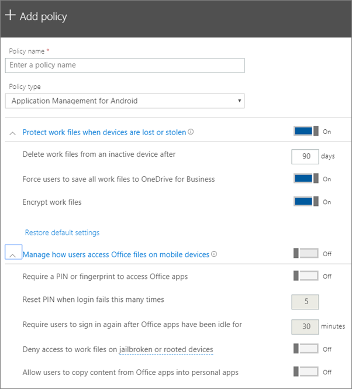

# Android veya iOS cihazlara yönelik uygulama koruma ayarlarını belirleme

Bu makale Microsoft 365 Business Premium için geçerlidir.

## Uygulama yönetimi ilkesi oluşturma

1. 'deki yönetici merkezine <a href="https://go.microsoft.com/fwlink/p/?linkid=837890" target="_blank">https://admin.microsoft.com</a> gidin. 
    
2. Sol gezinmede, **Devices** \> **Aygıtİlkeleri** \> **Ekle'yi**seçin.
  
3. **İlke ekle** bölmesinde bu ilke için benzersiz bir ad girin. 
    
4. **Politika türüne**göre, oluşturmak istediğiniz politika kümesine bağlı **olarak, iOS için**Android veya Uygulama Yönetimi için **Uygulama Yönetimi'ni** seçin. 
    
5. **Aygıtlar kaybolduğunda veya çalındığında iş dosyalarını koru'nun** genişletilmesi ve **kullanıcıların mobil cihazlardaki Office dosyalarına nasıl erişmelerini yönetin.** Ayarları istediğiniz gibi yapılandırın. **Kullanıcıların mobil cihazlardaki Office dosyalarına nasıl erişeceklerini yönetin** varsayılan olarak **Kapalıdır,** ancak **açmanızı** ve varsayılan değerleri kabul etmeyi öneririz. Daha fazla bilgi için [Kullanılabilir ayarlara](#available-settings)bakın. 
    
    Varsayılan ayarlara geri dönmek için istediğiniz zaman **Varsayılan ayarlara sıfırla** seçeneğini kullanabilirsiniz. 
    
    
  
6. Next decide **Who will get these settings?** Varsayılan **Tüm Kullanıcılar** güvenlik grubunu kullanmak istemiyorsanız, **Değiştir'i**seçin, bu ayarları alan güvenlik gruplarını seçin \> **Seçin.**
    
7. Son olarak, **Bitti**'yi seçerek ilkeyi kaydedin ve cihazlarınıza atayın. 
    
## Uygulama yönetimi ilkesini düzenleme

1. **İlkeler** kartında, **politikayı edit'i**seçin.
    
2. **İlkeyi düzenle** bölmesinde değiştirmek istediğiniz ilkeyi seçin. 
    
3. İlkedeki değerleri değiştirmek için her ayarın yanında bulunan **Düzenle**'yi seçin. Bir değeri değiştirdiğinizde, bu değer otomatik olarak ilke kaydedilir.
    
4. İşiniz bittiğinde, **Edit ilkesi** bölmesini kapatın. 
    
## Uygulama yönetimi ilkesini silme

1. **İlkeler** sayfasında bir ilke seçin ve sonra **silin.**
    
2. Sil **ilkesi** bölmesinde, seçtiğiniz ilke veya ilkeleri silmek için **Onayla'yı** seçin. 
    
## Kullanılabilir ayarlar

Aşağıdaki tablolar, aygıtlarda çalışma dosyalarını korumak için kullanılabilen ayarlar ve kullanıcıların Mobil aygıtlarından Office dosyalarına nasıl erişeceklerini kontrol eden ayarlar hakkında ayrıntılı bilgi verir.
  
 Daha fazla bilgi için, [Microsoft 365 Business Premium haritadan Intune ayarlarına koruma özelliklerinin nasıl olduğunu](map-protection-features-to-intune-settings.md)görün. 
  
### İş dosyalarını koruyan ayarlar

Bir kullanıcının cihazı kaybolursa veya çalınırsa, iş dosyalarını korumak için aşağıdaki ayarlar kullanılabilir:
  
|||
|:-----|:-----|
|Ayar    |Açıklama    |
|İş dosyalarını şu kadar gün sonra etkin olmayan cihazdan sil    |Burada belirttiğiniz gün sayısı için bir aygıt kullanılmazsa, aygıtta depolanan çalışma dosyaları otomatik olarak silinir.    |
|Tüm kullanıcıları iş dosyalarını OneDrive İş üzerine kaydetmeye zorla    |Bu ayar **Açık**ise, iş dosyaları için kullanılabilir tek kaydetme konumu İş için OneDrive'dır.    |
|İş dosyalarını şifrele    |İş dosyalarınızın şifreleme ile korunması için bu ayarı **Açık** tutun. Cihaz kaybolsa veya çalınmış olsa bile, şirket verilerinizi kimse okuyamaz.    |
   
### Kullanıcıların Office dosyalarına mobil cihazlardan erişimini denetleyen ayarlar

Kullanıcıların Office iş dosyalarına erişimini yönetmek için şu ayarlar kullanılabilir:
  
|||
|:-----|:-----|
|Ayar    |Açıklama    |
|Office uygulamalarına erişirken PIN veya parmak izi iste    |Bu ayar **On** Açık'sa, kullanıcıların mobil cihazlarında Office uygulamalarını kullanabilmeleri için kullanıcı adlarına ve parolalarına ek olarak başka bir kimlik doğrulama biçimi sağlamaları gerekir.  |
|Belirli sayıda başarısız oturum açma girişimi yapıldığında PIN'i sıfırla    |Yetkisiz bir kullanıcının PIN'i rastgele tahmin etmesini engellemek için belirlediğiniz sayıda yanlış giriş yapılırsa PIN sıfırlanır.    |
|Office uygulamaları belirli bir süre boyunca boşta kalırsa kullanıcıların yeniden oturum açmasını iste    |Bu ayar, kullanıcıdan yeniden oturum açması istenmeden önce ne kadar süre yle boşta kalınabileceğini belirler.    |
|Jailbreak uygulanmış veya kök erişim izni verilmiş cihazlardan iş dosyalarına erişilmesini engelle    |Akıllı kullanıcılar, bir cihaza jailbreak uygulamış veya kök erişim izni sağlamış olabilir. Bu, işletim sisteminin kullanıcı tarafından değiştirilebileceği ve dolayısıyla, cihazın kötü amaçlı yazılımlara karşı daha savunmasız hale gelebileceği anlamına gelir. Bu ayar **Açık** olduğunda böyle cihazlar engellenir.    |
|Kullanıcıların Office uygulamalarından gelen içeriği kişisel uygulamalara kopyalamasına izin verme    |Bu duruma varsayılan olarak izin verilir, ancak bu ayar **Açık** olduğunda kullanıcı bir iş dosyasındaki bilgileri kişisel bir dosyaya aktarabilir. Ayar **Kapalı** durumdaysa, kullanıcı iş hesabındaki bilgileri kişisel bir uygulamaya veya kişisel hesaba kopyalayamaz.    |
