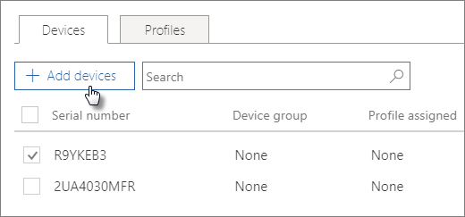

# AutoPilot cihazlarını oluşturma ve düzenlemeCreate and edit AutoPilot devices

## Cihaz listesini karşıya yüklemeUpload a list of devices

Aygıtyüklemek için [adım adım kılavuzunu](add-autopilot-devices-and-profile.md) kullanabilirsiniz, ancak **Aygıtlar** sekmesine aygıt yükleyebilirsiniz.You can use the [Step-by-step guide](add-autopilot-devices-and-profile.md) to upload devices, but you can also upload devices in the **Devices** tab. 
  
Aygıtlar bu gereksinimleri karşılamalıdır:Devices must meet these requirements:
  
- Windows 10, sürüm 1703 veya sonrasıWindows 10, version 1703 or later
    
- Windows'dan kutudan çıkma deneyiminden geçmemiş yeni aygıtlarNew devices that haven't been through Windows out-of-box experience

1. Microsoft 365 yönetici merkezinde, **Cihazlar** \> **Otomatik Pilot**seçin.In the Microsoft 365 admin center, choose **Devices** \> **AutoPilot**.
  
2. Otomatik **Pilot** sayfasında, **Aygıtlar** \> sekmesini seçin **aygıtlar ekle.**On the **AutoPilot** page, choose the **Devices** tab \> **Add devices**.
    
    
  
3. Aygıt **ekle** panelinde, **Kaydet** \> **Kapat'ı**kaydet'i \> hazırladığınız [Aygıt listesi CSV dosyasına](https://docs.microsoft.com/microsoft-365/admin/misc/device-list) göz atın.On the **Add devices** panel, browse to a [Device list CSV file](https://docs.microsoft.com/microsoft-365/admin/misc/device-list) that you prepared \> **Save** \> **Close**.
    
    Bu bilgileri donanım satıcınızdan alabilir veya Bir CSV dosyası oluşturmak için [Get-WindowsAutoPilotInfo PowerShell komut dosyasını](https://www.powershellgallery.com/packages/Get-WindowsAutoPilotInfo) kullanabilirsiniz.You can get this information from your hardware vendor, or you can use the [Get-WindowsAutoPilotInfo PowerShell script](https://www.powershellgallery.com/packages/Get-WindowsAutoPilotInfo) to generate a CSV file. 
    
## Cihaza veya cihaz grubuna profil atamaAssign a profile to a device or a group of devices

1. **Windows'u Hazırla** sayfasında **Aygıtlar** sekmesini seçin ve bir veya daha fazla aygıtın yanındaki onay kutusunu seçin.On the **Prepare Windows** page, choose the **Devices** tab, and select the check box next to one or more devices. 
    
2. **Cihaz** panelinde, **Atanan profil** açılan listesinden bir profil seçin.On the **Device** panel, select a profile from the **Assigned profile** drop-down. 
    
    Henüz hiç profiliniz yoksa, yönergeler için bkz. [AutoPilot profillerini oluşturma ve düzenleme](create-and-edit-autopilot-profiles.md).If you don't have any profiles yet, see [Create and edit AutoPilot profiles](create-and-edit-autopilot-profiles.md) for instructions. 
    
