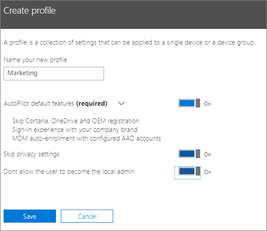
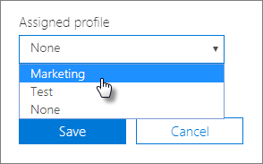

# AutoPilot profillerini oluşturma ve düzenlemeCreate and edit AutoPilot profiles

## Profil oluşturmaCreate a profile

Profiller bir cihaza veya cihaz grubuna uygulanır,A profile applies to a device, or a group of devices,
  
1. Microsoft 365 yönetim merkezinde  Cihazlar \> **AutoPilot'u seçin.**In the Microsoft 365 admin center, choose **Devices** \> **AutoPilot**.
  
2. **AutoPilot sayfasında** Profil oluştur **sekmesini** \> **seçin.**On the **AutoPilot** page, choose the **Profiles** tab \> **Create profile**.
    
3. Profil **oluştur sayfasında,** profili tanımlamanıza yardımcı olacak bir ad (örneğin, Pazarlama) girin.On the **Create profile** page, enter a name for the profile that helps you identify it, for example Marketing. Istediğiniz ayarı seçin ve kaydet'i **seçin.**Turn on the setting you want, and then choose **Save**. AutoPilot profil ayarları hakkında daha fazla bilgi için bkz. [AutoPilot Profili ayarları hakkında.](autopilot-profile-settings.md)For more information about AutoPilot profile settings, see [About AutoPilot Profile settings](autopilot-profile-settings.md).
    
    
  
### Cihaza profil uygulamaApply profile to a device

Profili oluşturdukta, bir cihaza veya cihaz grubuna uygulayabilirsiniz.After you create a profile, you can apply it to a device or a group of devices. Adım adım kılavuzda mevcut  bir profili seçerek yeni cihazlara uygulayabilir veya bir cihaz ya da cihaz grubu için mevcut profili değiştirebilirsiniz.You can pick an existing profile in the [step-by-step guide](add-autopilot-devices-and-profile.md) and apply it to new devices, or replace an existing profile for a device or group of devices. 
  
1. **Windows'u Hazırla** sayfasında **Cihazlar** sekmesini seçin.On the **Prepare Windows** page, choose the **Devices** tab. 
    
2. Cihaz adının yanındaki onay kutusunu seçin ve  Cihaz panelinde Atanan profil açılan listesinden **bir** profil \> **seçin.**Select the check box next to a device name, and in the **Device** panel, choose a profile from the **Assigned profile** drop-down list \> **Save**.
    
    
  
## Profili düzenleme, silme veya kaldırmaEdit, delete, or remove a profile

Bir profili bir cihaza atadıktan sonra, cihazı daha önce bir kullanıcıya vermiş olsanız bile profili güncelleştirebilirsiniz. Cihaz İnternet'e bağlandığında, kurulum sırasında profilinizin en son sürümünü indirir. Kullanıcı cihazı varsayılan fabrika ayarlarına sıfırladığında da cihaz, profilinize yönelik en son güncelleştirmeleri indirir.Once you've assigned a profile to a device, you can update it, even if you've already given the device to a user. When the device connects to the internet, it downloads the latest version of your profile during the setup process. If the user restores their device to its factory default settings, the device will again download the latest updates to your profile. 
  
### Profili düzenlemeEdit a profile

1. **Windows'u Hazırla** sayfasında **Profiller** sekmesini seçin.On the **Prepare Windows** page, choose the **Profiles** tab. 
    
2. Cihaz adının yanındaki onay kutusunu seçin ve Profil panelinde, **kullanılabilir** Kaydet ayarlarından herhangi birini \> **güncelleştirin.**Select the check box next to a device name, and in the **Profile** panel, update any of the available settings \> **Save**.
    
    Bunu cihaz bir kullanıcı tarafından İnternet'e bağlanmadan önce gerçekleştirirseniz, profil kurulum işlemine uygulanır.If you do this before a user connects the device to the internet, then the profile gets applied to the setup process.
    
### Profili silmeDelete a profile

1. **Windows'u Hazırla** sayfasında **Profiller** sekmesini seçin.On the **Prepare Windows** page, choose the **Profiles** tab. 
    
2. Cihaz adının yanındaki onay kutusunu seçin ve  Profil panelinde Profil Kaydet'i **sil'i** \> **seçin.**Select the check box next to a device name, and in the **Profile** panel, select **Delete profile** \> **Save**.
    
    Silinen profiller, atanmış oldukları cihazdan veya cihaz grubundan kaldırılır.When you delete a profile, it gets removed from a device or a group of devices it was assigned to.
    
### Profili kaldırmaRemove a profile

1. **Windows'u Hazırla** sayfasında **Cihazlar** sekmesini seçin.On the **Prepare Windows** page, choose the **Devices** tab. 
    
2. Cihaz adının yanındaki onay kutusunu seçin ve  Cihaz panelinde Atanan  profil **açılan** listesinde Kaydet'i \> seçin.Select the check box next to a device name, and in the **Device** panel, choose **None** from the **Assigned profile** drop-down list \> **Save**.
    
