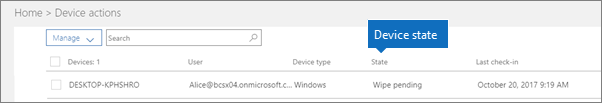

# Cihaz durumlarıDevice states

Bu makale Microsoft 365 İş Ekstra için geçerlidir.This article applies to Microsoft 365 Business Premium.

**Cihaz eylemleri** listesindeki (Yönetim giriş sayfası \> **Cihaz eylemleri**) cihazlar aşağıdaki durumlarda olabilir.Devices in the **Device actions** list (Admin home \> **Device actions**) can have the following states.
  

  
|**Durum****Status**|**Açıklama****Description**|
|:-----|:-----|
|Intune tarafından yönetilenManaged by Intune    |Microsoft 365 İş Ekstra tarafından yönetilir.Managed by Microsoft 365 Business Premium.    |
|Devre dışı bırakma bekliyorRetire pending    |Microsoft 365 İş Ekstra, cihazdan şirket verilerini kaldırmaya hazırlanıyor.Microsoft 365 Business Premium is getting ready to remove company data from the device.    |
|Devre dışı bırakma sürüyorRetire in progress    |Microsoft 365 İş Ekstra şu anda cihazdan şirket verilerini kaldır çalışıyor.Microsoft 365 Business Premium is currently removing company data from the device.    |
|Devre dışı bırakma başarısızRetire failed    | Şirket verilerini kaldırma işlemi başarısız oldu.Remove company data action failed.    |
|İptal edildiRetire canceled    |Kaldır eylemi iptal edildi.Retire action was canceled.    |
|Temizleme işlemi beklemedeWipe pending    |Fabrika sıfırlamasının başlatılması bekleniyor.Waiting for factory reset to start.    |
|Temizleme işlemi sürüyorWipe in progress    |Fabrika sıfırlaması gönderildi.Factory reset has been issued.    |
|Temizleme başarısız olduWipe failed    |Fabrika sıfırlaması yapamadım.Couldn't do factory reset.    |
|Temizleme işlemi iptal edildiWipe canceled    |Fabrika temizleme işlemi iptal edildi.Factory wipe was canceled.    |
|Uygun olmayan durumdaUnhealthy    |Bekleyen (veya devam eden) bir eylem var, ancak cihaz 30 gün boyunca iade edildi.An action is pending (or in progress), but the device hasn't checked in for 30+ days.    |
|Silme bekliyorDelete pending    |Silme eylemi bekliyor.Delete action is pending.    |
|BulunduDiscovered    |Microsoft 365 İş Ekstra cihazı algıladı.Microsoft 365 Business Premium has detected the device.    |
   
