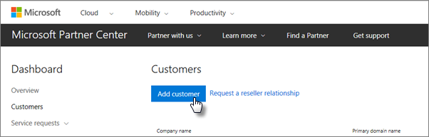
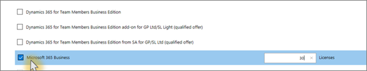

# Microsoft 365 İş Ekstra’yı edinin

## Microsoft'tan Microsoft 365 Business Premium alın

Bir iş ortağınız yoksa ve Microsoft 365 Business Premium almak istiyorsanız, [buradan satın](https://www.microsoft.com/en-US/microsoft-365/business)alabilirsiniz.

Ayrıntılı talimatlar [için Microsoft 365 Business Premium'a kaydolun.](sign-up.md)

Microsoft 365 Business Premium satın almak ve kurulum yardımı almak için bir [Microsoft Mağazası'na](https://www.microsoft.com/en-us/store/locations/find-a-store?icid=en_US_Store_UH_FAS) da gidebilirsiniz.
  
## Microsoft İş Merkezi'nden Microsoft 365 Business Premium'u alın

1. Bulut Hizmeti Sağlayıcısı (CSP) programına kaydolurken oluşturduğunuz kimlik bilgilerini kullanarak [Microsoft İş Ortağı Merkezi](https://go.microsoft.com/fwlink/p/?linkid=849910)'nde oturum açın. 
    
2. İş Ortağı Panosu'nda **Müşteriler'i**seçin, ardından müşterinizi seçin veya Microsoft 365 Business Premium'u almadan önce yeni bir müşteri ekleyin.
    
    
  
3. Müşterinin **Abonelik** **sayfasında, Abonelik Ekle'yi**seçin, Katalog'un altındaki Küçük işletme seçeneğini seçin ve ardından **Microsoft 365 Business Premium'u**seçin.
    
    İhtiyacınız olan lisans sayısını (en fazla 300) seçin. 300'den fazla kullanıcınız varsa, bunun yerine [Microsoft 365 Enterprise'a](https://go.microsoft.com/fwlink/p/?linkid=862316) bakın. 
    
    
  
    İşletme adı da dahil olmak üzere yeni bir müşteri eklemek için adımların geri kalanını tamamlayın.
    

