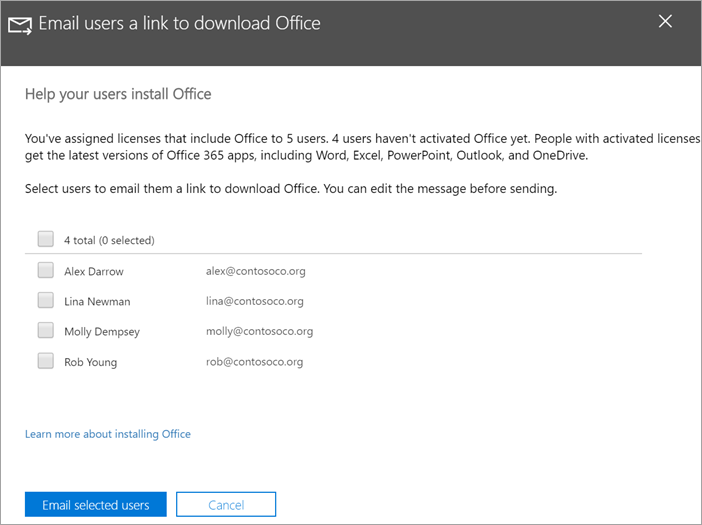

# Kullanıcılarının Windows 10 cihazlarına Office yüklemesini yardımcı olunHelp your users install Office on Windows 10 devices

Microsoft 365 yönetim merkezinden Windows 10 bilgisayarlara Office'i hızla ve kolayca yükleyebilirsiniz.You can quickly and easily install Office on Windows 10 PCs from the Microsoft 365 admin center.
  
Daha önce yüklenmiş Office uygulamaları olduğunda bu işlemin nasıl çalıştığını anlamak için, başlamadan önce [Office istemci yüklemesi hazırlığı](prepare-for-office-client-deployment.md) konusunu okuyun.To understand how this works with previously installed Office apps, read [Prepare for Office client installation](prepare-for-office-client-deployment.md) before you get started.

Office uygulamalarını yükleme hakkında kısa bir video izleyin.Watch a short video about installing Office apps.  

> [!VIDEO https://www.microsoft.com/videoplayer/embed/acce002c-0756-4b64-ac5d-2198ee96a9b1] 

Bu videoyu faydalı bulduysanız, [küçük işletmelere ve Microsoft 365’i ilk kez kullananlara yönelik eğitim serisinin tamamına göz atın](https://support.microsoft.com/office/6ab4bbcd-79cf-4000-a0bd-d42ce4d12816).If you found this video helpful, check out the [complete training series for small businesses and those new to Microsoft 365](https://support.microsoft.com/office/6ab4bbcd-79cf-4000-a0bd-d42ce4d12816).

## Office dağıtımlarını yönetmeManage Office deployments

1. Yönetim merkezine gidin ve <a href="https://go.microsoft.com/fwlink/p/?linkid=2024339" target="_blank">https://admin.microsoft.com</a> genel yönetici kimlik bilgileriyle oturum açma.Go to the admin center at <a href="https://go.microsoft.com/fwlink/p/?linkid=2024339" target="_blank">https://admin.microsoft.com</a>, and sign in with global admin credentials. 

2. Sol gezinti **bölmesinde** Kurulum'a gidin ve Kurulum sayfasında Uygulamalar **ve** güncelleştirmeler'e **ilerleyin.**Go to **Setup** in the left navigation pane, and on the **Setup** page, scroll to **Apps and updates**.
    > [!NOTE]
    > Tüm kullanıcılarınız Office uygulamalarını yüklemişse bu kartı görmeyebilirsiniz.You might not see this card if all of your  users have installed Office apps.
  
3. Yardım **kullanıcılarının Office uygulamaları kartını yüklemelerine yardımcı** olun, Görünüm'e **ve** sonra da **Başla'ya tıklayın.**On the **Help users install their Office apps** card, choose **View**, and then **Get started**.
    
4. **E-posta kullanıcılarına Office panelini indirme** bağlantısında, e-postayla göndermek istediğiniz kullanıcıları seçin ve ardından E-postayla **seçilen kullanıcılara e-posta gönderin.**On the **Email users a link to download Office** panel, select the users you want to email, and then **Email selected users**.

   

## Microsoft 365 İş Ekstra'ı ayarlama ve kullanma hakkında daha fazla bilgi içinFor more on setting up and using Microsoft 365 Business Premium

[İş için Microsoft 365 eğitim videolarıMicrosoft 365 for business training videos](https://support.microsoft.com/office/6ab4bbcd-79cf-4000-a0bd-d42ce4d12816)