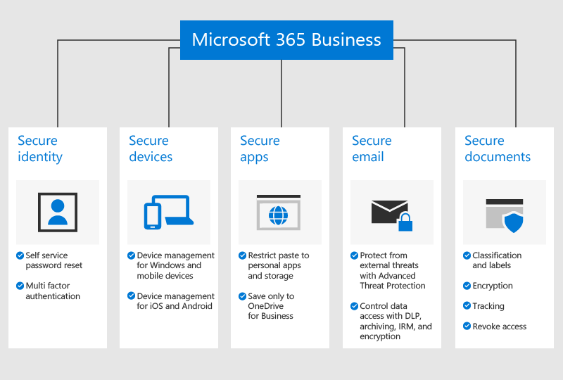

# Microsoft 365 Business'a Genel Bakış

## Microsoft 365 İş nedir?

Microsoft 365 Business, Office 365 üretkenlik araçlarının yanı sıra işletmenizi siber tehditlere karşı korumaya, verilerinizi korumaya ve cihazları yönetmeye yardımcı olacak gelişmiş yetenekleri içeren bir abonelik hizmetidir.

Microsoft 365 Business'a hızlı bir genel bakış için bu videoyu izleyin.  

> [!VIDEO https://www.microsoft.com/videoplayer/embed/RE2mhaA] 
  
Bu videoyu faydalı bulduysanız, [küçük işletmelere ve Microsoft 365’i ilk kez kullananlara yönelik eğitim serisinin tamamına göz atın](https://support.office.com/article/6ab4bbcd-79cf-4000-a0bd-d42ce4d12816).   

Microsoft 365 Business, 300'e kadar lisans içindir. Daha fazla lisansa ihtiyacınız varsa, daha fazla bilgi için [Microsoft 365 Kurumsal](https://go.microsoft.com/fwlink/p/?linkid=860986) belgelerine bakın.

Tüm özellikler listesi için [Microsoft 365 İş hizmeti açıklamasına](https://docs.microsoft.com/office365/servicedescriptions/microsoft-365-service-descriptions/microsoft-365-business-service-description) bakın.
  
## Küçük işletme güvenlik ihtiyaçları

İş verileriniz birçok şekilde tehlikeye atılabilir. Siz ve kullanıcılarınız, gizliliği ihlal edilen kimlik bilgileriyle oturum açtığınızda veya farklı aygıtlarda ve uygulamalarda kuruluş verilerini görüntülediğinizde kuruluşunuzun güvenliğini tehlikeye atabilirsiniz. Daha ayrıntılı olarak, kuruluşunuz şu nedenlerden dolayı risk altındadır:

- Gizliliği ihlal edilen veya zayıf oturum açma kimlik bilgileri.
- Zayıf bir pime sahip bozulmuş aygıt veya kullanıcıya ait bir aygıt.
- Kuruluşunuzun verilerini kişisel uygulamalara kopyala/yapıştırabilen/kaydedebilen kullanıcılar.
- Güvenlik zayıf olan üçüncü taraf uygulamaları yükleyen ve kullanan kullanıcılar.
- Hassas verilerin paylaşılması, kimlik avı girişimleri, kötü amaçlı yazılımlar ve benzeri e-posta güvenlik açıkları.
- Olmaması gereken kişiler, hassas bilgilere sahip belgelere erişebilir.

Microsoft 365 Business, bu örneklerin her birinde verilerinizin korunmasına yardımcı olur. İş verilerinizi koruyan güvenlik özellikleri aşağıdaki şekilde ayrıntılı olarak açıklanmaktadır.

## Verileriniz ve cihazlarınız nasıl korunur?

Microsoft 365 Business, şu nedenlerle **tehditlere karşı savunmaya** yardımcı olur:

- Güvenli olmayan web sitelerini (ATP Güvenli Bağlantılar) engellemek için e-postalardaki ve belgelerdeki bağlantıları gerçek zamanlı olarak taramak.

- Yeni geliştirilen kötü amaçlı yazılımları (ATP Güvenli Ekler) tespit etmek için bir kum havuzu ortamında e-posta ekleri gelişmiş analiz gerçekleştirin. 

- Gelişmiş saldırılara (ATP kimlik avı önleme zekası) karşı koruma sağlamak için makine öğrenimi modellerini ve kimliğe bürünme algılamayı kullanan kimlik avı önleme ilkelerini etkinleştirme. 

- Güvenilmeyen konumlardan erişimi devre dışı eden veya ofis ağınız gibi güvenilir yerlerden çok faktörlü kimlik doğrulamasını atlayan gelişmiş ilkeler ayarlama (güvenilir IP'ler dahil Azure MFA ve Koşullu Erişim). 

- Kuruluşunuzun tüm Windows 10 cihazlarında kötü amaçlı yazılım koruması nın uygulanması ve anahtar sistem klasörlerinde bulunan dosyaların ransomware (Windows Defender) tarafından yapılan değişikliklere karşı korunması

**İş verileriniz** şu şekilde korunur:

- Sosyal Güvenlik numaraları veya kredi kartları gibi hassas bilgilerin işletmenizin dışına sızmasını önlemeye yardımcı olmak için otomatik algılamayı kullanma (veri kaybıönleme). 

- Müşterilerinizle veya kuruluşunuz dışındaki diğer kişilerle güvenli bir şekilde iletişim kurabilmeniz için hassas e-postaları şifreleme. Bu, yalnızca hedeflenen alıcının iletiyi (Office 365 İleti Şifrelemesi) okumasını sağlar.

- E-posta ve belgelere **"Kopyalama"** ve **Iletme gibi** kısıtlamalar uygulayarak şirket bilgilerine kimlere erişebilenleri kontrol etmek (Azure Bilgi Koruması, Plan 1).

- Eski çalışanların posta kutuları (Exchange Online Arşivleme) dahil olmak üzere kuruluşunuzun tüm e-postalarını tutabilmeniz için sınırsız bulut arşivlemesini etkinleştirme.

Cihazlarınız aşağıdaki ler tarafından **güvenli hale alınmıştır:**

- Hangi cihazların ve kullanıcıların Office 365 verilerinize erişebileceğini ve kullanıcıların ev bilgisayarlarından, onaylanmamış uygulamalardan veya çalışma saatleri dışında oturum açmalarını engelleme seçenekleriyle (Koşullu Erişim) denetleme.

- iOS ve Android cihazlardaki iş verilerini korumak için güvenlik ilkeleri uygulamak. Örneğin, kullanıcıların iş verilerine erişmek için PIN veya parmak izi sağlamalarını ve mobil cihazlardaki verileri şifrelemelerini (Office mobil uygulamaları için Uygulama koruması) alabilirsiniz.

- İş belgelerini, e-postaları ve diğer verileri onaylı Office mobil uygulamalarında tutmak ve çalışanların bunları yetkisiz uygulamalara ve konumlara kaydetmesini önlemek (Office mobil uygulamaları için Uygulama koruması).

- Kişisel bilgileri etkilemeden kaybolan veya çalınan cihazlardaki iş verilerini uzaktan silmek (Intune seçici silme).

- Şirketinizdeki tüm Windows 10 bilgisayarlarının ilkelerini yönetmek için basitleştirilmiş denetimleri kullanarak BitLocker şifrelemesini uygulayın ve kritik Windows güncelleştirmelerini otomatik olarak yükleyin (Windows güncelleştirme ilkelerini uygulayın).

Güvenlik özelliklerinin tam listesini görmek için [Microsoft 365 İş güvenlik özelliklerine](security-features.md)bakın. Microsoft [365 Business'ı ayarladıktan](set-up.md)sonra, [tehdit korumayı artırın](increase-threat-protection.md) ve kılavuzlu kurulumun bir parçası olarak dahil olmayan güvenlik özellikleriyle başlamak için [uyumluluk özelliklerini ayarlayın.](set-up-compliance.md) Ayrıca, siber suçlulara ve bilgisayar korsanlarına karşı korumalar nasıl ayarlanıncaya ilişkin iyi bir genel bakış için [Office 365 ve Microsoft 365 İş planlarını güvence altına almanın en iyi 10 yolunu](https://docs.microsoft.com/office365/admin/security-and-compliance/secure-your-business-data) da okuyun.

## Microsoft 365 İş'i edinme

- Bir iş ortağınız varsa, Microsoft 365 Business: [Microsoft 365 Business'ı Microsoft İş Ortağı Merkezi'nden alın.](get-microsoft-365-business.md#get-microsoft-365-business-from-microsoft-partner-center)

- Bir iş ortağınız yoksa ve Microsoft 365 Business'ı almak istiyorsanız, [buradan satın alabilir](https://www.microsoft.com/microsoft-365/business) ve [kaydolma](sign-up.md) yönergelerini takip edebilirsiniz.

- Ayrıca, hem Microsoft 365 Business satın almak hem de kurulum yardımı almak için bir [Microsoft Mağazası'na](https://www.microsoft.com/en-us/store/locations/find-a-store?icid=gm_fy18_hol_bopis_feature3&CustomerIntent=Consumer) gidebilirsiniz.

    > [!NOTE]
    > Bu bağlantı sadece ABD'deki mağazalar içindir

## Ayrıca bkz.

[Microsoft 365 İş eğitim videoları](https://support.office.com/article/6ab4bbcd-79cf-4000-a0bd-d42ce4d12816)
