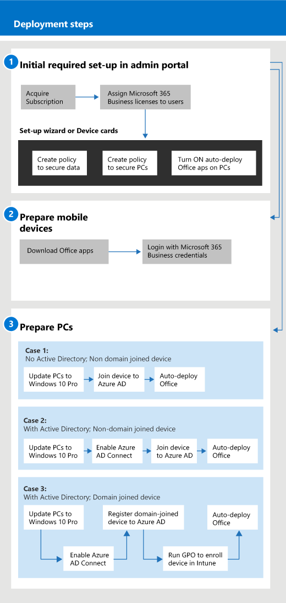

# İşletmeler için Microsoft 365 ile başlayın

## İşletmeler için Microsoft 365 nedir

İşletmeler için Microsoft 365, Outlook, Word, Excel ve diğer Office ürünleri gibi her zaman güncel olan kapsamlı bir iş üretkenliği ve işbirliği araçları kümesidir. İş dosyalarınızı tüm iOS, Android ve Windows 10 aygıtlarınızda, yönetilmesi kolay kurumsal sınıf güvenlikle koruyabilirsiniz.

İşletmeler için Microsoft 365'e hızlı bir genel bakış için bu videoyu izleyin.  

> [!VIDEO https://www.microsoft.com/videoplayer/embed/RE2mhaA] 
  
İşletmeler için Microsoft 365, 300'e kadar lisans içindir. Daha fazla lisansa ihtiyacınız varsa, daha fazla bilgi için [Microsoft 365 Kurumsal](https://go.microsoft.com/fwlink/p/?linkid=860986) belgelerine bakın. 
  
## İşletmeler için Microsoft 365'i alın

- İş ortağınız varsa, iş için Microsoft 365 alırsınız: [Microsoft İş Ortağı Merkezi'nden iş için Microsoft 365'i alın.](get-microsoft-365-business.md)
    
- Bir iş ortağınız yoksa ve microsoft 365'i iş için almak istiyorsanız, [buradan satın](https://www.microsoft.com/microsoft-365/business)alabilirsiniz.
    
## İşletmeler için Microsoft 365'i ayarlama

 **Business Suite kurulumu için Microsoft 365'e genel bakış**
  
Aşağıdaki diyagramda, yöneticilerin Microsoft 365'i işletme için nasıl kurdukları açıklanmaktadır. Ayrıca, microsoft 365 için windows bilgisayarların iş için hazırlanması adımlarını da açıklar. Ayrıca [Windows AutoPilot](add-autopilot-devices-and-profile.md)ile Microsoft 365 yönetici merkezinde yeni cihazlar ekleyebilirsiniz. Yeni aygıtları kurmak ve önceden yapılandırmak için Otomatik Pilot'u, kullanıcı iş kimlik bilgileri için Microsoft 365 ile birlikte girer imzalamaz verimli kullanıma hazır olmaları için önceden yapılandırmak için kullanabilirsiniz.
  

İş kurulumu için Microsoft 365'e genel bir bakış için bu videoyu izleyin.  

> [!VIDEO https://www.microsoft.com/videoplayer/embed/RE1FYSM] 

Bu videoyu faydalı bulduysanız, [küçük işletmelere ve Microsoft 365’i ilk kez kullananlara yönelik eğitim serisinin tamamına göz atın](https://support.office.com/article/6ab4bbcd-79cf-4000-a0bd-d42ce4d12816).  

  
### 1: İşletmeler için Microsoft 365'i ayarlama (Yönetici)

Genel yönetici kimlik bilgilerinizle [Microsoft 365 yönetici merkezinde](https://portal.office.com/adminportal/home) oturum açın ve iş için Microsoft 365'i ayarlamak için aşağıdaki adımları tamamlayın. 
  
1. [İşletmeler için Microsoft 365'e sahip cihazlardaki verileri korumak için ön koşullar](pre-requisites-for-data-protection.md)
    
    Aygıtlarınızın microsoft 365 için iş için hazır olduğundan emin olmak için önce ön koşulları okuyun.
    
2. [İşletmeler için Microsoft 365'i ayarlamak için kurulum sihirbazını kullanma](set-up.md)
    
    Yerel bir **Active Directory'den buluta kalıcı olarak hareket**ediyorsanız, Microsoft 365 yönetici merkezine gidebilir ve kullanıcılarınızı el ile eklemek için kurulum sihirbazını kullanabilir veya Azure AD Connect ile tek seferlik eşitleme yapabilirsiniz. Bunu yapmanın iki yolu vardır: 
    
    - Exchange 2010, Exchange 2013 veya Exchange 2016 sunucunuz da varsa, [Exchange posta kutularını Office 365'e hızla geçirmek için Minimal Karma'yı kullanabilirsiniz.](https://support.office.com/article/fdecceed-0702-4af3-85be-f2a0013937ef) En az karma adımlar, kullanıcıların Azure AD ile tek seferlik eşitlemeyi ve şirket içi buluta e-posta geçişini içerir. E-posta geçişi tamamlandıktan sonra, bu yöntemi kullandığınızda dizin eşitlemesi otomatik olarak kapatılır.
    
    - Kullanıcılarınızı bulutla eşitlemek için dizin eşitleme sihirbazını kullanın. Bu işlemi tamamlamak [için Microsoft 365 için dizin eşitlemesi](https://support.office.com/article/1b3b5318-6977-42ed-b5c7-96fa74b08846) ayarla'daki adımları izleyin. Kullanıcılarınızı bulutla eşitledikten sonra [Office 365 için dizin eşitlemesi kapatmanız](https://support.office.com/article/ee5f861e-bd48-4267-83d1-a4ead4b4a00d)gerekir.
    
    Ayrıca, bu şekilde eklenen her kullanıcıya iş için Microsoft 365'e lisans vermeniz gerekir. Bunu [kurulum sihirbazında](set-up.md) yapabilir veya [microsoft 365'teki kullanıcılara iş için lisans atayabilirsiniz.](https://support.office.com/article/997596B5-4173-4627-B915-36ABAC6786DC)
    
### 2: Mobil cihazları hazırlama

İş kullanıcılarının Office uygulamalarını cihazlara yüklemeleri ve iş için Microsoft 365 tarafından korunduklarına emin olmaları [için Microsoft 365 için mobil aygıtlar ayarlama](set-up-mobile-devices.md) adımlarını izleyin. 
  
### 3: Hazırlayın CD'ler

Yöneticiler, [Windows AutoPilot'u](add-autopilot-devices-and-profile.md)kullanarak yeni Windows 10 bilgisayarları için ayarları önceden seçebilirler. Kullanıcılar bu konudaki adımları izleyerek varolan veya yeni Windows 10 aygıtlarını ayarlayabilir: [İş kullanıcıları için Microsoft 365 için Windows bilgisayarları ayarlayın.](set-up-windows-devices.md) Varolan aygıtlar için kullanıcılar **dosyaları isteğe bağlı olarak** [OneDrive for Business'a taşıyabilir.](move-files-to-onedrive.md) Windows profiliyle ilişkili dosyaları OneDrive'a taşımak için üçüncü taraf araçlarını da kullanabilirler.
  
Kuruluşunuz Windows Server Active Directory'yi şirket içinde kullanıyorsa, Windows 10 aygıtlarınızı korumak için iş için Microsoft 365'i ayarlayabilir ve yerel kimlik doğrulaması gerektiren şirket içi kaynaklara erişimi sürdürebilirsiniz. İşletmelerin bunu ayarlaması [için Microsoft 365 tarafından yönetilecek etki alanına birleştirilmiş Windows 10 aygıtlarını etkinleştirme](manage-windows-devices.md) adımlarını izleyin. Bu yöntem tercih edilir ve bu durumdaki aygıtlar **Karma Azure AD birleştirilmiş aygıtlar**olarak adlandırılır. 
  
Bazı şirket içi kaynakları (dosya paylaşımları ve yazıcılar gibi) içeren yerel bir Etkin Dizin'i korursanız, **Azure AD'ye katılan aygıtlarınıza** buradaki adımları izleyerek bu kaynaklara erişim sağlayabilirsiniz: [Microsoft 365'teki Azure AD'ye bağlı bir aygıttan](access-resources.md)şirket içi kaynaklara iş için erişebilirsiniz.
  
  
## Desteğe başvurun

 **Desteğe başvurmanız gerekiyorsa:**
  
- İş ortağınızla iletişime geçin.
    
- İş yöneticisi için Microsoft 365 olarak, müşteri destek ekibimize erişebilirsiniz: ** [İş ürünleri için destekle iletişime geçin - Yönetici Yardımı](https://support.office.com/article/32a17ca7-6fa0-4870-8a8d-e25ba4ccfd4b)**
    
## Ayrıca bkz.

[İş belgeleri ve kaynakları için Microsoft 365](https://go.microsoft.com/fwlink/p/?linkid=853701)
  
[İşletmeler için Microsoft 365'i yönetin](manage.md)[İşletmeler için Microsoft 365'e geçirin](migrate-to-microsoft-365-business.md)

[İş eğitimi videoları için Microsoft 365](https://support.office.com/article/6ab4bbcd-79cf-4000-a0bd-d42ce4d12816) 
