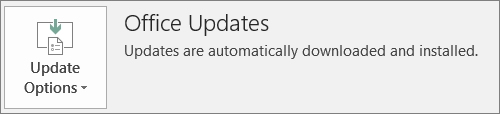

# Microsoft 365 İş tarafından Office istemci dağıtımı hazırlığıPrepare for Office client deployment by Microsoft 365 for business

Bu makale Microsoft 365 İş Ekstra için geçerlidir.This article applies to Microsoft 365 Business Premium.

## İstemci bilgisayarlara Office uygulamalarını otomatik olarak yükleme hazırlığıPrepare to automatically install Office apps to client computers

32 bit Office uygulamalarını Windows 10 bilgisayarlara otomatik olarak yüklemek ve güncelleştirmelerle güncel tutmak için Microsoft 365 İş Ekstra'ya kullanabilirsiniz.You can use Microsoft 365 Business Premium to automatically install the 32-bit Office apps on Windows 10 computers and keep them current with updates.
  
Otomatik yükleme en iyi şekilde, son kullanıcının bilgisayarı Windows 10 Business'da ise ve:Automatic installation works best if the end user's computer is on Windows 10 Business and:
  
- Mevcut Office masaüstü uygulamaları (Word, Excel, PowerPoint, Outlook, OneNote, Publisher, Access ve OneDrive) bulunmamalıdır.Doesn't have existing Office desktop apps (Word, Excel, PowerPoint, Outlook, OneNote, Publisher, Access, and OneDrive).
    
    veyaor
    
- Office'in Tıkla-Çalıştır sürümü yüklü olmalıdır.Has an existing version of Click-to-Run Office installed.
    
Office'in Tıkla-Çalıştır sürümüne sahip olup olmadığınızı belirlemek için, herhangi bir Office uygulamasında **Dosya** \> **Hesap**'a (Outlook'ta **Office Hesabı**) gidin.To determine if you have the Click-to-Run version of Office, in any Office app go to **File** \> **Account** ( **Office Account** in Outlook). Aşağıdaki şekilde **gösterildiği gibi Office** Güncelleştirmeleri görüyorsanız, yükleme Tıkla-Çalıştır kullanılarak yapılır.If you see **Office Updates** as shown in the following figure, then the installation was done by using Click-to-Run. 
  

  
 **Bu özele sahip olmak kimlerin avantajlarına sahip olacak?****Who benefits from having this feature**
  
Bilgisayarı aşağıdaki özelliklere sahip olan son kullanıcılar:The end user whose PC:
  
- **Windows**  10 Business kullanıcı lisansı, etkin bir Microsoft 365 İş lisansı, Windows 10 Creators Update vardır ve Azure Active Directory'ye katılmış durumdadır.**Has**  a Windows 10 Business user license, an active Microsoft 365 for business license, Windows 10 Creators Update, and is joined to Azure Active Directory. 
    
- **64** bit Office uygulamaları (örneğin: Word, Excel, PowerPoint) yok.**Doesn't have** 64-bit Office apps (example: Word, Excel, PowerPoint). 64 bit Office uygulamaları gerekli ise, bu özellik uygun değildir çünkü microsoft 365 İş yönetici konsolundan Office'in 64 bit 2016 Tıkla-Çalıştır sürümünü tetikleme desteği yoktur.If 64-bit Office apps are required, then this feature isn't a good fit because there's no support for triggering a 64-bit 2016 Click-to-Run version of Office from the Microsoft 365 for business admin console. 
    
- Herhangi bir 2016 Windows Installer (MSI) tek başına uygulaması (örneğin, Visio veya Project) **yoktur**.**Doesn't have** any 2016 Windows Installer (MSI) standalone apps (for example, Visio or Project). Microsoft 365 İş, Office'i Office 2016'nın Tıkla-Çalıştır sürümüne yükselter ve bu da Office 2016 MSI tek başına uygulamalarıyla işe yaramadı.Microsoft 365 for business upgrades Office to the Click-to-Run version of Office 2016 and that doesn't work with Office 2016 MSI standalone apps. 
    
Aşağıdaki tabloda, son kullanıcıların/yöneticilerin, başlangıç durumlarına bağlı olarak, işletmeler için Microsoft 365 yönetici konsolundan Office'in 32 bit Tıkla-Çalıştır sürümünün dağıtımını başarılı bir şekilde yapmak için hangi eylemi uygulaması gerekten olduğu görüntülenir.The following table shows what action the end users/admins may need to take, depending on their beginning state, to have a successful 32-bit Click-to-Run version of Office deployment from the Microsoft 365 for business admin console. 

|Başlangıçtaki Office yükleme durumuStarting Office install status|Microsoft 365 İş Office'i yüklemeden önce at gereken eylemAction to take before Microsoft 365 for business Office install|Son durumEnd state|
|:-----|:-----|:-----|
|Hiçbir Office paketi yüklü değilNo Office suite installed    |YokNone    |Tıkla-Çalıştır kullanılarak Office 2016 32 bit yüklenirOffice 2016 32-bit is installed by using Click-to-Run    |
|Office'in Tıkla-Çalıştır 32 bit sürümü (2016 veya önceki) var ve tek başına uygulama yokExisting Click-to-Run 32-bit version of Office (2016 or earlier) and no standalone apps    |YokNone    |Gerektiği gibi Office 2016'nın en son 32 bit Tıkla-Çalıştır sürümüne yükseltilir **\***Upgraded to the latest 32-bit Click-to-Run version of Office 2016, as needed **\***   |
|Office'in Tıkla-Çalıştır 32 bit sürümü ve Tıkla-Çalıştır 32 bit veya 64 bit tek başına Office uygulamaları (örneğin, Visio, Project) varExisting Click-to-Run 32-bit version of Office and Click-to-Run 32-bit or 64-bit standalone Office apps (for example, Visio, Project)    |YokNone    |Tek başına uygulamalar etkilenmez.Standalone apps aren't affected. Paket, Office 2016'nın Tıkla-Çalıştır 32 bit sürümüne yükseltilirSuite is upgraded to Click-to-Run 32-bit version of Office 2016    |
|Office'in Tıkla-Çalıştır 32 bit sürümü ve 32 bit veya 64 bit (2016 dışında) MSI tek başına Office uygulamaları varExisting Click-to-Run 32-bit version of Office and any 32-bit or 64-bit (except 2016) MSI standalone Office apps    |YokNone    |Tek başına uygulamalar etkilenmez.Standalone apps aren't affected. Paket, Office 2016'nın Tıkla-Çalıştır 32 bit sürümüne yükseltilirSuite is upgraded to Click-to-Run 32-bit version of Office 2016    |
|Office'in Tıkla-Çalıştır 64 bit sürümü varAny existing Click-to-Run 64-bit version of Office    |64 bit Office uygulamalarını 32 bit Office uygulamalarıyla değiştirmek sorun yoksa bunları kaldırınUninstall the 64-bit Office apps, if it's OK to replace them with 32-bit Office apps    |Office 64 bit uygulamaları kaldırılmışsa, Office 2016'nın Tıkla-Çalıştır 32 bit sürümü yüklenirIf Office 64-bit apps are removed, the Click-to-Run 32-bit version of Office 2016 is installed    |
|Tek başına uygulamalarla veya bu uygulamalar olmadan Office 2016'nın MSI yüklemesi varAn existing MSI install of Office 2016 with or without standalone apps    |MSI Office 2016'yı kaldırın.Uninstall MSI Office 2016.    |Office 2016'nın Tıkla-Çalıştır 32 bit sürümü yüklenir. Tek başına uygulamalarda hiçbir değişiklik olmazClick-to-Run 32-bit version of Office 2016 is installed. No change to standalone apps    |
|Office 2013'ün (veya önceki sürümlerin) ve/veya tek başına Office uygulamalarının MSI yüklemesi varExisting MSI install of Office 2013 (or earlier) and/or standalone Office apps    |YokNone    |Office 2016'nın Tıkla-Çalıştır 32 bit sürümü, önceden var olan MSI Office yüklemesiyle (ve tek başına uygulamalarla) birlikte kullanılırClick-to-Run 32-bit version of Office 2016 with the pre-existing MSI Office install (and standalone apps) exist side-by-side    |
||||
   
 **(\*) Not:** Bilinen bir hata nedeniyle Office 2016'nın Tıkla-Çalıştır 32 bit sürümüne yükseltilmez.**(\*) Note:** Does not upgrade to Click-to-Run 32-bit version of Office 2016 due to a known bug. Düzeltme için çalışma devam etmektedir.A fix is in progress. 
  
