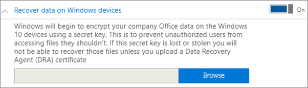
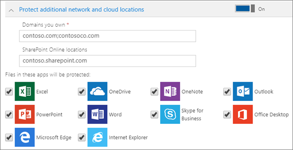

# Windows 10 cihazlarında uygulama koruma ayarlarını ayarlama veya düzenleme

Bu makale Microsoft 365 Business Premium için geçerlidir.

## Windows 10 için uygulama yönetimi ilkesini düzenleme

1. Yönetim Merkezi 'ne gidin <a href="https://go.microsoft.com/fwlink/p/?linkid=837890" target="_blank">https://admin.microsoft.com</a> .     
2. Sol gezintide, **cihazlar** \> **ilkeleri** 'ni seçin.
1. Var olan bir Windows App ilkesi seçin ve ardından **düzenleyin**.
1. Değiştirmek istediğiniz ayarın yanındaki **Düzenle** 'yi ve sonra **Kaydet**'i seçin.

## Windows 10 için uygulama yönetimi ilkesi oluşturma

Kullanıcılarınızın işle ilgili görevleri gerçekleştirdikleri kişisel Windows 10 cihazları varsa, verilerinizi bu cihazlarda da koruma altına alabilirsiniz.
  
1. Yönetim Merkezi 'ne gidin <a href="https://go.microsoft.com/fwlink/p/?linkid=837890" target="_blank">https://admin.microsoft.com</a> . 
2. Sol gezintide, **cihaz** \> **ilkeleri** \> **Ekle**'yi seçin.
3. **İlke ekle** bölmesinde bu ilke için benzersiz bir ad girin. 
4. **İlke türü**'nün altında **Windows 10 için Uygulama Yönetimi**'ni seçin.
5. **Cihaz türü**altında **Kişisel** veya **Şirket sahibi**'i seçin.
6. **İş dosyalarını şifrele** seçeneği otomatik olarak açılır. 
7. Kullanıcıların çalışma dosyalarını kendi bilgisayarlarına kaydetmelerini istemiyorsanız, **Kullanıcıların şirket verilerini kişisel dosyalara kopyalamasını engelle ve çalışma dosyalarını OneDrive İş'e kaydetmelerini zorla** ilkesini **Açık** olarak ayarlayın. 
9. **Windows cihazlarında verileri kurtar 'ı**genişletin. Açmanızı **öneririz.**
    Veri kurtarma aracısı sertifikasının konumuna göz atabilmeniz için önce bir tane oluşturmanız gerekir. Yönergeler için, [şifreleme dosya sistemi (EFS) veri kurtarma aracısı (DRA) sertifikası oluşturma ve doğrulama](https://go.microsoft.com/fwlink/p/?linkid=853700)konusuna bakın.
    
    Varsayılan olarak iş dosyalarınız, cihazda depolanan ve kullanıcının profili ile ilişkilendirilmiş bir gizli anahtar kullanılarak şifrelenir. Yalnızca kullanıcı dosyanın şifresini çözebilir ve dosyayı açabilir. Bununla birlikte, cihaz kaybolursa veya kullanıcı kaldırılırsa, dosya şifrelenmiş halde kalabilir. Yönetici, dosyanın şifresini çözmek için veri kurtarma aracısı (DRA) sertifikasını kullanabilir.
    
    
  
10. Listelenen tüm uygulamalardaki dosyaların korunduğundan emin olmak için ek etki alanları veya SharePoint Online konumları eklemek istiyorsanız **ek ağ ve bulut konumlarını koruma** seçeneğini genişletin. Alanlara birden çok öğe girmeniz gerekiyorsa, öğeler arasında noktalı virgül (;) kullanın.
    
    
  
11. Next decide **Who will get these settings?** If you don't want to use the default **All Users** security group, choose **Change**, choose the security groups who will get these settings \> **Select**.
12. Son olarak, **Ekle**'yi seçerek ilkeyi kaydedin ve cihazlarınıza atayın. 
