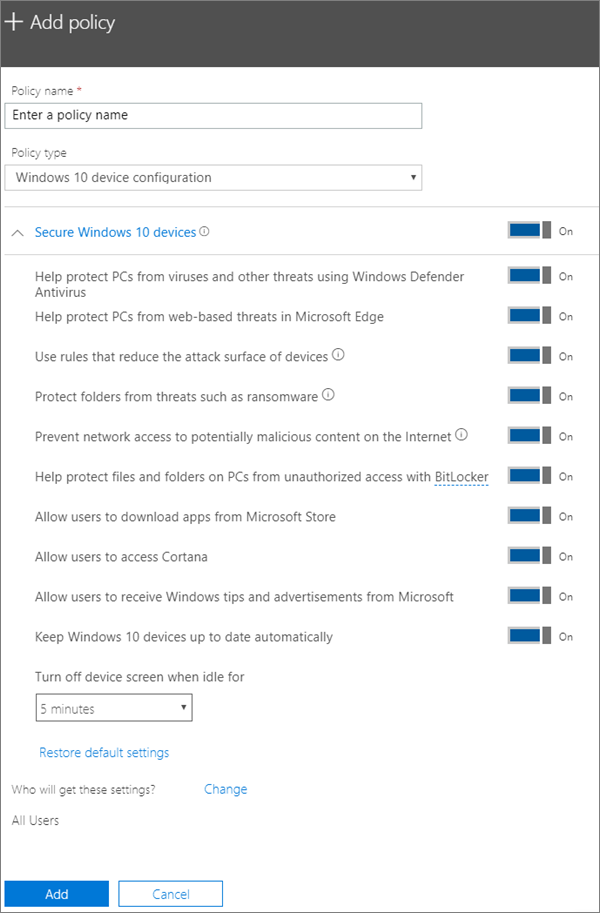

# Windows 10 bilgisayarlar için cihaz koruma ayarlarını düzenleme veya oluşturma

Bu makale Microsoft 365 İş Ekstra için geçerlidir.

Kurulum sayfasında varsayılan Windows koruma ayarlarını ayardikten sonra, tüm kullanıcılara veya bir kullanıcı kümesine uygulanacak yenilerini ekleyin. Ayrıca, oluşturdukları herhangi birini de düzenleyebilirsiniz.

## Windows 10 cihazları için koruma ayarları oluşturma

Microsoft 365 İş Ekstra ile Windows 10 cihazlarının güvenliğini sağlama hakkında bir video izleyin:
  
> [!VIDEO https://www.microsoft.com/videoplayer/embed/a5734146-620a-4cec-8618-536b3ca37972?autoplay=false]
  
1. Yönetim merkezine <a href="https://go.microsoft.com/fwlink/p/?linkid=837890" target="_blank">https://admin.microsoft.com</a> gidin: 
2. Sol gezintide Cihaz **İlkeleri** \> **Ekle'yi** \> **seçin.**
3. **İlke ekle** bölmesinde bu ilke için benzersiz bir ad girin. 
4. **İlke türü**'nün altında **Windows 10 Cihaz Yapılandırması**'nı seçin.
5. Expand **Secure Windows 10 Devices** \> configure the settings how you would like. Daha fazla bilgi için bkz. [Kullanılabilir ayarlar](#available-settings). 
    
    Varsayılan ayarlara dönmek için istediğiniz zaman **Varsayılan ayarlara sıfırla** bağlantısını kullanabilirsiniz. 
    
    
  
6. Next decide **Who will get these settings?** If you don't want to use the default **All users** security group, Choose **Change**, search for the security group who will get these settings \> **Select**.
7. Son olarak, **Bitti**'yi seçerek ilkeyi kaydedin ve cihazlarınıza atayın. 

## Windows 10 koruma ayarlarını düzenleme
 
1. Yönetim merkezine <a href="https://go.microsoft.com/fwlink/p/?linkid=837890" target="_blank">https://admin.microsoft.com</a> gidin:     
2. Sol gezintide Cihaz **İlkeleri'ne** \> **seçin.**
1. Var olan bir Windows cihaz ilkesi seçin ve ardından **Düzenle'yi seçin.**
1. Değiştirmek **istediğiniz** ayarın yanındaki Düzenle'yi ve ardından Kaydet'i **seçin.**

## Kullanılabilir ayarlar

Varsayılan olarak tüm ayarlar **Açık** durumdadır. Aşağıdaki ayarlar kullanılabilir.
  
Daha fazla bilgi için [bkz. Microsoft 365 Premium'daki koruma özellikleri ile Intune ayarları nasıl eşler.](map-protection-features-to-intune-settings.md) 
  
|||
|:-----|:-----|
|Ayar    |Açıklama    |
|Windows Defender Virüsten Koruma kullanarak bilgisayarların virüslere ve diğer tehditlere karşı korunmasına yardımcı ol    |Bilgisayarları internete bağlı olmanın getirdiği tehlikelerden korumak için Windows Defender Virüsten Koruma programının açık olması gerekir.    |
|Bilgisayarları Microsoft Edge'de web tabanlı tehditlere karşı korumaya yardımcı ol    |Edge'de, kullanıcıları kötü amaçlı sitelerden ve indirmelerden korumaya yardımcı olan ayarları açar.    |
|Cihazların saldırı alanını azaltan kuralları kullan    |Saldırı alanı azaltma özelliği açık olarak ayarlandığında zararlı yazılımlar tarafından cihazlara bulaşmak için tipik olarak kullanılan eylemleri ve uygulamaları engeller. Bu ayar yalnızca Windows Defender Virüsten Koruma yazılımı Açık olarak ayarlandığında kullanılabilir. Daha fazla bilgi edinmek için [Saldırı alanlarını azaltma](/windows/security/threat-protection/microsoft-defender-atp/exploit-protection) bölümüne bakın.    |
|Klasörleri fidye yazılımı gibi tehditlerden koruma    |Bu ayar, şirket verilerini fidye yazılımı gibi şüpheli veya zararlı uygulamalar tarafından gerçekleştirilen değişikliklere karşı korumak için denetimli klasör erişimini kullanır. Bu türdeki uygulamaların korumalı klasörlerde değişiklik yapması engellenir. Bu ayar yalnızca Windows Defender Virüsten Koruma yazılımı Açık olarak ayarlandığında kullanılabilir. Daha [fazla bilgi edinmek için Denetimli klasör erişimiyle](/mem/configmgr/protect/deploy-use/create-deploy-exploit-guard-policy#bkmk_CFA) klasörleri koruma'ya bakın.    |
|İnternetteki olası zararlı içeriklerin ağa erişimini engelle    |Kimlik avı dolandırıcılığı, açıkları kullanan yazılımlar veya diğer kötü amaçlı içerikleri barındırabilecek, itibarı düşük İnternet konumlarına giden kullanıcı bağlantılarını engellemek için bu ayarı kullanın. Bu ayar yalnızca Windows Defender Virüsten Koruma Açık olarak **ayarlanmışsa kullanılabilir.** Daha fazla bilgi için [bkz. Anızı koruma.](/windows/security/threat-protection/windows-defender-antivirus/configure-real-time-protection-windows-defender-antivirus)    |
|BitLocker ile PC'lerdeki dosyaların ve klasörlerin yetkisiz erişime karşı korunmasına yardımcı ol    |BitLocker bilgisayar sabit sürücülerini şifreleyerek verileri korur ve bilgisayar kaybolduğunda veya çalındığında verilerin açığa çıkma durumuna karşı koruma sağlar. Daha fazla bilgi için [Bitlocker SSS bölümüne bakın.](/windows/security/information-protection/bitlocker/bitlocker-frequently-asked-questions)    |
|Kullanıcıların Microsoft Store'ndan uygulama indirmesine izin ver    |Kullanıcıların Microsoft Store'ndan uygulama indirmesine ve yüklemesine izin verir. Uygulamalar, oyunlardan üretkenlik araçlarına kadar her şeyi içerebilir, dolayısıyla bu ayar **Açık** durumdadır ancak ek güvenlik için kapatabilirsiniz.    |
|Kullanıcıların Cortana'ya erişmesine izin ver    |Cortana çok yararlı olabilir! Cortana sizin için ayarları açmak veya kapatmak, yol tarifleri vermek ve randevular için zamanında hazır olduğundan emin olabilir; dolayısıyla bu ayar varsayılan **olarak Açık** durumdadır.    |
|Kullanıcıların Microsoft'tan Windows ipucu ve reklam almasına izin ver    |Windows ipuçları kullanışlı olabilir ve yeni özellikler kullanıma sunulduğunda kullanıcıların yönlendirilmesine yardım edebilir.    |
|Windows 10 cihazları otomatik olarak güncelleştir    |Windows 10 cihazların son güncelleştirmeleri otomatik olarak aldığından emin olur.    |
|Cihaz şu kadar süre boşta kaldığında ekranı kapat    |Kullanıcı cihaz başında olmadığında şirket verilerinin korunmasını sağlar. Kullanıcı bir kafe gibi herkese açık bir konumda çalışıyorken kısa süreliğine uzaklaşabilir veya başka bir şeyle ilgilenebilir ve bu sırada diğer kişiler cihazdaki bilgilere bakabilir. Bu ayar sayesinde, ekran kapanmadan önce kullanıcının ne kadar süre boşta olabileceğini denetleyebilirsiniz.    |