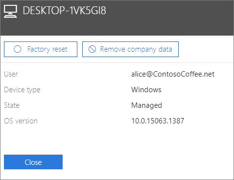

# Şirket verilerini cihazlardan kaldırmaRemove company data from devices

## Şirket verilerini kaldırmaRemove company data

Microsoft 365'i, kullanıcılarınızın [cihazlarında](app-protection-settings-for-android-and-ios.md) veya Microsoft 365 tarafından korunan [Windows bilgisayarlarında](protection-settings-for-windows-10-devices.md) sahip olduğu şirket verilerini kaldırmak için iş için Microsoft 365'i kullanabilirsiniz.You can use Microsoft 365 for business to remove company data that your users have on their [devices](app-protection-settings-for-android-and-ios.md) or [Windows PCs](protection-settings-for-windows-10-devices.md) that are protected by Microsoft 365. **Cihazdan kaldırdığınız şirket verilerini daha sonra geri yükleyemezsiniz**.**If you remove company data from a device, you cannot restore it later**. 
  
1. 'deki <a href="https://go.microsoft.com/fwlink/p/?linkid=837890" target="_blank">https://admin.microsoft.com</a>yönetici merkezine gidin.Go to the admin center at <a href="https://go.microsoft.com/fwlink/p/?linkid=837890" target="_blank">https://admin.microsoft.com</a>.
    
2. Sol daki gezinmede, **Aygıtları** \> **Yönet'i**seçin.  On the left nav, choose **Devices**  \> **Manage**.
  
3. **Yönet** sayfasında, kaldırmak istediğiniz verileri seçen veya arayan bir kullanıcı yı seçin ve adı seçin.On the **Manage** page, choose or search for a user who's data you want to remove, and choose the name. 
    
4. Bir sonraki bölmede Aygıtlar **listesinden** aygıtı veya cihazları seçin.On the next pane, select the device or devices from the **Devices** list. Açılan aygıt bölmesinde, aygıtı fabrika ayarlarına sıfırlamayı veya aygıt türüne bağlı olarak şirket verilerini kaldırmayı seçebilirsiniz.On the device pane that opens, you can choose to reset the device to factory settings or remove company data, depending on the device type. 
    
    
  
5. Onay bölmesine, \> **Kapat'ı** **Onayla'yı** seçin.On the confirmation pane, choose **Confirm** \> **Close**.
    

