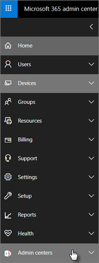

# Microsoft 365 İş Ekstra ve uyumluluk özelliklerini daha iyi ifade edin

Microsoft 365 İş Ekstra bilgisayarlar, telefonlar ve tabletler ile verilerinizi korumaya yardımcı olmak için basitleştirilmiş güvenlik özellikleri sunar.
    
## Microsoft 365 yönetim merkezi özellikleri

Yönetim merkezinde, bu özellikleri Microsoft 365 İş Ekstra açmanın veya kapatmanın basitleştirilmiş bir yolunu veren birçok güvenlik özelliklerini yönetebilrsiniz. Yönetim merkezinde şunları yapabilirsiniz:
  
- [Android veya iOS cihazları için uygulama yönetimi ayarlarını yapın.](app-protection-settings-for-android-and-ios.md) 
    
    Bu ayarlar arasında, belirli bir süre sonra etkin olmayan cihazdan dosyaları silme, iş dosyalarını şifreleme ve kullanıcıların PIN ayarlaması gibi işlemleri içerir.
    
- [Mobil cihazlar için uygulama Windows 10 ayarlayın.](protection-settings-for-windows-10-devices.md) 
    
    Bu ayarlar hem şirkete ait hem de kişisel olarak sahip olunan cihazlardaki şirket verilerine uygulanabilir.
    
- [Mobil cihazlar için cihaz Windows 10 ayarlayın.](protection-settings-for-windows-10-pcs.md) 
    
    Bir cihazın kaybolur veya çalınırsa verilerin korunmasına yardımcı olmak için [BitLocker](/windows/security/information-protection/bitlocker/bitlocker-frequently-asked-questions) şifrelemesi'ni etkinleştirebilirsiniz ve fidye yazılımlarına karşı gelişmiş koruma sağlamak için [Windows Exploit Guard'ı](/windows/security/threat-protection/microsoft-defender-atp/enable-exploit-protection) etkinleştirebilirsiniz. 
    
- [Cihazlardan şirket verilerini kaldırma](remove-company-data.md)
    
    Cihaz kaybolursa, çalınırsa veya bir çalışan şirketten ayrılırsa şirket verilerini uzaktan temizleyebilirsiniz.
    
- [Cihaz Windows 10 fabrika ayarlarına sıfırlayın.](reset-devices-to-factory-settings.md) 
    
    Cihaz koruma ayarlarının Windows 10 olduğu tüm cihazları sıfırlayabilirsiniz.
    
## Ek güvenlik özellikleri 

Yeni Microsoft 365 İş Ekstra, işlerinizi siber tehditlere karşı korumanıza ve hassas bilgileri korumaya yardımcı olmak için kullanılabilir.
  
- **[Office 365 için Microsoft Defender](../security/office-365-security/defender-for-office-365.md)**
    
    Office 365 için Microsoft Defender, çalışanın veya müşteri bilgisinin güvenliğini tehlikeye atarak tasarlanan gelişmiş kimlik avı ve fidye yazılımı saldırılarına karşı işlerinizi korumanıza yardımcı olur. Özellikler şunlardır:
    
  - Tehlikeli iletileri tespit etmek ve atmak için gelişmiş ek tarama ve yapay zeka destekli çözümleme.
    
  - Bunların kimlik avı dolandırıcılığı kapsamında olup olmadığını değerlendirmek için e-posta bağlantılarının otomatik denetimleri. Bu, güvenli olmayan web sitelerine erişmenizi engeller.

- **[Azure portalında Intune'a sahip tüm özellikler](/mem/intune/fundamentals/what-is-intune)**
    
    Azure portalında Intune yönetim merkezine erişim, macOS cihazları, iPhone ve Android cihazlarının yönetimi gibi ek güvenlik özelliklerinin yanı sıra, Windows için gelişmiş cihaz yönetimi ayarlamaya olanak tanır ve bu özellikler Microsoft 365 yönetim merkezi.
- **Azure AD Premium P1  planıyla aynı Koşullu Erişim**

    Koşullu Erişim, kuruma oturum açma risklerinden, beklenmeyen bir ağ veya yerel ağa erişim denemelerine, riskli cihaz türlerinden erişim girişimlerine, bu gibi risklere karşı korunmanıza yardımcı olabilir. Koşullu Erişim ilkeleri, ilk kimlik doğrulama tamamlandıktan sonra uygulanır ve ilk kimlik doğrulama olayından sinyaller kullanarak erişimin onay mı, reddedilmiş mi yoksa daha fazla kanıta (ikinci bir kimlik biçimi gibi) gerek olup olmadığını belirler.

    Koşullu erişim özellikleri şunlardır:

    - Kullanıcı adı, grup ve role dayalı erişim
    - Uygulamaya [dayalı erişim](/azure/active-directory/conditional-access/app-based-conditional-access) 
    - [Konuma dayalı erişim](/azure/active-directory/authentication/howto-registration-mfa-sspr-combined#conditional-access-policies-for-combined-registration);  yalnızca güvenilen IP aralıklarından veya belirli ülkelerden erişime izin verme 
    - Erişim için MFA gerektirme
    - Eski kimlik doğrulaması kullanan uygulamalara [erişimi engelleme](/azure/active-directory/conditional-access/block-legacy-authentication)
    - Uygulamaların [Intune uygulama korumasını kullanmasını gerektirme](/azure/active-directory/conditional-access/app-protection-based-conditional-access)
    - Üçüncü taraf sağlayıcılarla MFA gibi özel kimlik doğrulama, örneğin DUO.
   
    Diğer özellikler:
    - [Karma](/azure/active-directory/authentication/concept-sspr-customization) Azure AD için self servis parola sıfırlama
    
## Uyumluluk özellikleri

Microsoft 365 İş Ekstra aboneliğiniz uyumluluk ve mevzuat standartlarını korumanıza yardımcı olacak özellikler içerir.

- **[Veri kaybını önleme hakkında bilgi edinmek için](../compliance/dlp-learn-about-dlp.md))** (DLP). 
    
    DLP'i, kredi kartı numaraları, sosyal güvenlik numaraları gibi hassas bilgileri otomatik olarak algılayan ve şirket dışında yapılan yanlışlıkla paylaşımları önlemek için kurabilirsiniz.
    
- **[Exchange Online Arşivleme](https://products.office.com/exchange/microsoft-exchange-online-archiving-email)**
    
    Exchange Online Arşivleme lisansı, iletilerin sürekli veri yedeklemeyle kolayca arşivlenmiş olmasına olanak sağlar. Daha sonra bulma veya geri yükleme sırasında gerek duyulmaları durumuna karşı silinmiş öğeler de içinde olmak üzere, kullanıcının tüm e-postalarını depolar. Buna ek olarak, mahkeme bekletmeleri, eKbulma veya uyumluluk gereksinimlerini karşılamak için e-posta verilerini korumak üzere farklı bekletme ilkeleri kullanabilirsiniz.
    
- **[Duyarlılık etiketleri](../compliance/sensitivity-labels.md)**

   Microsoft 365 İş Ekstra planı, Azure Information [Protection Plan 1'in tüm özelliklerini içerir.](https://go.microsoft.com/fwlink/p/?linkid=871407) Bu planla, e-posta ve belgelerdeki hassas bilgilere erişimi "İlerlet" ve "Kopyalama" gibi denetimlerle denetlemenizi sağlayan Duyarlılık etiketleri oluşturabilirsiniz.  Ayrıca, hassas bilgileri "Gizli" olarak sınıflandırabilir ve sınıflandırılmış bilgilerin işletme içinde ve dışında nasıl paylaşıla olacağını belirtebilirsiniz. Enterprise- sınıf şifreleme, bilgilerin gizli tutmak için e-posta ve belgelere kolayca uygulanır. Ayrıca, diğer uygulamalar için Azure Information Protection istemci eklentisini Office yükleyebilirsiniz. Daha fazla bilgi için [bkz. Azure Information Protection birleşik etiketleme istemcisi.](/azure/information-protection/rms-client/unifiedlabelingclient-version-release-history) Duyarlılık etiketleri için, metin **AzInfoProtection_UL.exe.**

Bu özellikleri Güvenlik Uyumluluk Merkezi'nde &amp; ve Intune yönetim merkezinde yönetsiniz. Zaman içinde basitleştirilmiş denetimler diğer denetimlere Microsoft 365 yönetim merkezi.
  
    
## SSS

 ### Bu güvenlik özellikleri tüm pazarlarda kullanılabilir mi?
  
Evet, bu özellikler en çok satılan tüm Microsoft 365 İş Ekstra mevcuttur.
  
### Güvenlik Uyumluluk merkezini nasıl &amp; bulamıyorum?
  
1. [Yönetici kimlik Microsoft 365 İş Ekstra](https://portal.microsoft.com/) kullanarak oturum açma. 
    
2. Sol gezintide Yönetim **merkezleri'ni bulun** ve genişletin. 
    
    
  
3. Güvenlik **uyumluluk &amp; merkezi'ne** gitmek için Güvenlik Uyumluluğu'seçin. &amp;
