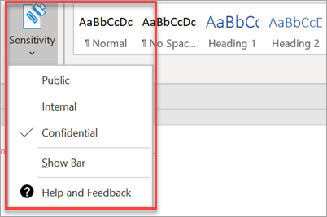

# Uyumluluk özelliklerini ayarlama

Microsoft 365 Business'ınız verilerinizi ve cihazlarınızı koruyan ve sizin ve müşterilerinizin hassas bilgilerini güvende tutmanıza yardımcı olan özelliklerle birlikte gelir.

## DLP özelliklerini ayarlama

Bkz. Kişisel olarak tanımlanabilir bilgilere (PII) karşı korumak için bir ilke oluşturma hakkında bir örnek için şablondan Bir [DLP ilkesi oluşturun.](https://support.office.com/article/59414438-99f5-488b-975c-5023f2254369) 
  
DLP, birçok farklı yerel bölge için kullanıma hazır ilke şablonlarıyla birlikte gelir. Örneğin, Avustralya Finansal Verileri, Kanada Kişisel Bilgiler Yasası, ABD Finansal Verileri ve benzeri. Tam liste için [DLP ilkesi şablonlarının neler içerdiğini](https://support.office.com/article/c2e588d3-8f4f-4937-a286-8c399f28953a) görün. Bu şablonların tümü, KIŞISEL bilgiler şablonu örneğine benzer şekilde etkinleştirilebilir. 
  
## Exchange Online Arşivleme ile e-posta saklama yı ayarlama

 **Exchange Online Arşivleme** lisansı özellikleri, e-posta içeriğini eDiscovery için koruyarak uyumluluk ve mevzuat standartlarını korumaya yardımcı olur. Ayrıca, bir dava varsa riskinizi azaltmaya yardımcı olur ve bir güvenlik ihlalinden sonra veya silinen öğeleri kurtarmanız gerektiğinde verileri kurtarmanın bir yolunu sağlar. Bir kullanıcının tüm içeriğini korumak için dava tutma yı kullanabilir veya korumak istediğiniz şeyi özelleştirmek için bekletme ilkelerini kullanabilirsiniz.
  
**Dava tutma:** Bir kullanıcının tüm posta kutusunu dava beklemeye alarak silinen öğeler de dahil olmak üzere tüm posta kutusu içeriğini koruyabilirsiniz. 
    
Yönetici merkezinde, dava beklemeye bir posta kutusu yerleştirmek için:
    
1. Sol navigasyonda, **Users** \> **Active kullanıcılarına**gidin.
    
2. Dava beklemeye almak istediğiniz posta kutusunu seçin. Kullanıcı **bölmesinde, Posta ayarlarını**genişletin ve **Daha Fazla ayar'ın**yanında **Exchange özelliklerini edit'i**seçin.
    
3. Kullanıcı için posta kutusu sayfasında, sol daki ** posta kutusu özelliklerini seçin ve ardından **Dava bekletme**altında **Etkinleştir** bağlantısını seçin.
    
4. Dava **tutma** iletişim kutusunda, **Dava tutma süresi** alanında dava tutma süresini belirtebilirsiniz. Sonsuz bir tutma yerleştirmek istiyorsanız alanı boş bırakın. Ayrıca notlar ekleyebilir ve posta kutusu sahibini dava tutma hakkında daha fazla açıklama nız gerekebilecek bir web sitesine yönlendirebilirsiniz. \>**Kaydet.**
    
**Bekletme:** Örneğin, belirli bir süre için korumak veya bekletme döneminin sonunda içeriği kalıcı olarak silmek için özelleştirilmiş bekletme ilkelerini etkinleştirebilirsiniz. Daha fazla bilgi için [bkz.](https://support.office.com/article/5e377752-700d-4870-9b6d-12bfc12d2423)

## Duyarlılık etiketlerini ayarlama

Duyarlılık etiketleri Azure Bilgi Koruması (AIP) Planı 1 ile birlikte gelir ve etiketler uygulayarak belgelerinizi ve e-postalarınızı sınıflandırmanıza ve isteğe bağlı olarak korumanıza yardımcı olur. Etiketler, kuralları ve koşulları tanımlayan yöneticiler tarafından, kullanıcılar tarafından el ile veya kullanıcılara önerilerin verildiği bir kombinasyon kullanılarak otomatik olarak uygulanabilir.

Duyarlılık etiketleri ayarlamak [için, duyarlılık etiketleri videosu oluşturma ve yönetme](https://support.office.com/article/2fb96b54-7dd2-4f0c-ac8d-170790d4b8b9) yi görüntüleyin.

### Azure Bilgi Koruması istemcisini el ile yükleme

AIP istemcisini el ile yüklemek için:

1. [Microsoft indirme merkezinden](https://www.microsoft.com/download/details.aspx?id=53018) **AzinfoProtection_UL.exe** indirin.
 
2. Yüklemenin bir Word belgesini görüntüleyerek ve **Duyarlılık** seçeneğinin **Giriş** sekmesinde kullanılabilir olduğundan emin olarak çalıştığını doğrulayabilirsiniz.
 

Daha fazla bilgi için [bkz.](https://docs.microsoft.com/azure/information-protection/infoprotect-tutorial-step3)
