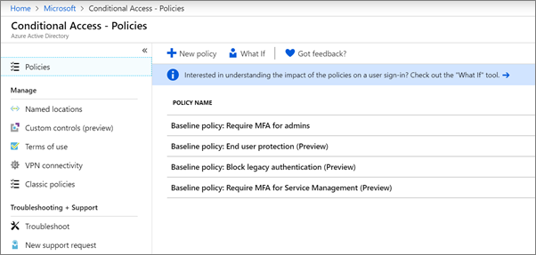

# Koşullu Erişim ilkelerini ayarlama

[Koşullu Erişim](https://docs.microsoft.com/azure/active-directory/conditional-access/overview) ilkeleri önemli ölçüde ek güvenlik ekler. Microsoft, tüm müşteriler için önerilen bir temel Koşullu Erişim ilkeleri kümesi sağlar. Temel ilkeler, kuruluşların birçok yaygın saldırıya karşı korunmasına yardımcı olan önceden tanımlanmış ilkeler kümesidir. Bu yaygın saldırılar parola püskürtme, yeniden oynatma ve kimlik avı içerebilir.

Bu ilkeler, belirli koşullar yerine getirildiğinde yöneticilerin ve kullanıcıların ikinci bir kimlik doğrulama biçimi (çok faktörlü kimlik doğrulama veya MFA olarak adlandırılır) girmesini gerektirir. Örneğin, bir kullanıcı farklı bir ülkeden oturum veriyorsa, oturum açma riskli kabul edilebilir ve kullanıcının ek bir kimlik doğrulama biçimi sağlaması gerekir. 

Şu anda, temel ilkeler şunlardır:
- **Yöneticiler için MFA'yı zorunlu kılması,** &ndash; genel yönetici de dahil olmak üzere en ayrıcalıklı yönetici rolleri için çok faktörlü kimlik doğrulaması gerektirir.
- **Son kullanıcı koruması** &ndash; Yalnızca oturum açma riskli olduğunda kullanıcılar için çok faktörlü kimlik doğrulaması gerektirir. 
- **Eski kimlik doğrulamayı** &ndash; engelleyin Eski istemci uygulamaları ve bazı yeni uygulamalar daha yeni, daha güvenli, kimlik doğrulama protokolleri kullanmaz. Bu eski uygulamalar Koşullu Erişim ilkelerini atlayabilir ve ortamınıza yetkisiz erişim sağlayabilir. Bu ilke, Koşullu Erişimi desteklemeyen istemcilerin erişimini engeller. 
- **Hizmet Yönetimi** &ndash; için MFA'yı zorunlu kılması Azure portalı (temel ilkeleri yapılandırdığınız yer) dahil olmak üzere yönetim araçlarına erişmek için çok faktörlü kimlik doğrulama gerektirir. 

Microsoft, bu temel ilkelerin tümünün etkinleştirilmesini önerir. Bu ilkeler etkinleştirildikten sonra, yöneticilerden ve kullanıcılardan Azure Multii-Factor kimlik doğrulaması için kaydolması istenir.

Bu ilkeler hakkında daha fazla bilgi için [temel ilkeler nelerdir?](https://docs.microsoft.com/azure/active-directory/conditional-access/concept-baseline-protection)

## Temel ilkeleri ayarlama

1. Azure [portalına](https://portal.azure.com)gidin ve ardından **Azure Etkin Dizin** \> **Koşullu Erişim'e**gidin.
    
    Temel ilkeler sayfada listelenir.    
    
1. Her ilke için aşağıdaki özel yönergeye bakın:

  - [Yöneticiler için MFA gerektirir](https://docs.microsoft.com/azure/active-directory/conditional-access/howto-baseline-protect-administrators)
- [Kullanıcılar için MFA gerektirir](https://docs.microsoft.com/azure/active-directory/conditional-access/howto-baseline-protect-end-users)  
 - [Eski kimlik doğrulamasını engelleme](https://docs.microsoft.com/azure/active-directory/conditional-access/howto-baseline-protect-legacy-auth)
  - [Hizmet yönetimi için MFA gerektirir](https://docs.microsoft.com/azure/active-directory/conditional-access/howto-baseline-protect-azure)

Onaylı istemci uygulamaları gerektirmek gibi birçok ek ilke ayarlayabilirsiniz. Daha fazla bilgi için [Koşullu Erişim Belgeleri'ne](https://docs.microsoft.com/azure/active-directory/conditional-access/)bakın.
