# Microsoft 365 için iş kullanıcıları için mobil aygıtlar ayarlama

iPhone'a veya Android telefona Office'i yüklemek için sekmelerdeki yönergeleri izleyin. Bu adımları izledikten sonra, Office uygulamalarında oluşturulan iş dosyalarınız iş için Microsoft 365 tarafından korunur.

Bu örnek Outlook üzerinden hazırlanmıştır, ancak bahsedilen işlemler yüklemek istediğiniz diğer tüm Office uygulamaları için geçerlidir.
  
## Mobil cihazları ayarlama

## [Iphone](#tab/iPhone)
  
İş için Microsoft 365 ile iOS aygıtlarında Office uygulamalarını nasıl ayarlayıp kurabilirsiniz hakkında kısa bir video izleyin.  

> [!VIDEO https://www.microsoft.com/videoplayer/embed/RWee2n] 

Bu videoyu faydalı bulduysanız, [küçük işletmelere ve Microsoft 365’i ilk kez kullananlara yönelik eğitim serisinin tamamına göz atın](https://support.office.com/article/6ab4bbcd-79cf-4000-a0bd-d42ce4d12816).  

**App Store**'a gidin ve arama alanına Microsoft Outlook yazın.
  
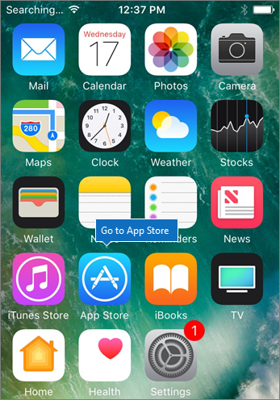
  
Bulut simgesine dokunarak Outlook'u yükleyin.
  
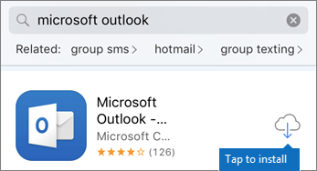
  
Yükleme tamamlandığında, **Aç** düğmesine dokunarak Outlook'u açın ve ardından **Başlarken**'e dokunun.
  
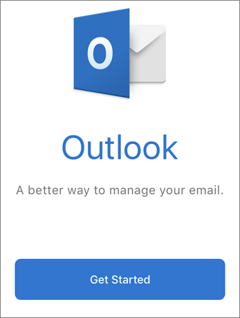
  
İş e-posta adresinizi **E-posta Hesabı** \> **Ekle**ekranına girin ve ardından \> iş kimlik bilgileri için Microsoft 365'inizi girin **Oturum açın.**
  
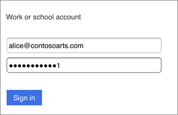
  
Kuruluşunuz uygulamalardaki dosyaları koruyorsa, kuruluşunuzun artık uygulamadaki verileri koruduğunu ve kullanmaya devam etmek için uygulamayı yeniden başlatmanız gerektiğini belirten bir iletişim kutusu görürsünüz. **Tamam**'a dokunun ve Outlook'u kapatın. 
  
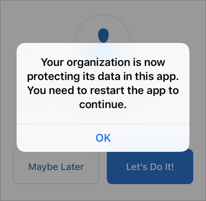
  
iPhone'da Outlook'u bulun ve yeniden başlatın. İstendiğinde, bir PIN girin ve doğrulayın. iPhone'unuzdaki Outlook artık kullanıma hazırdır.
  
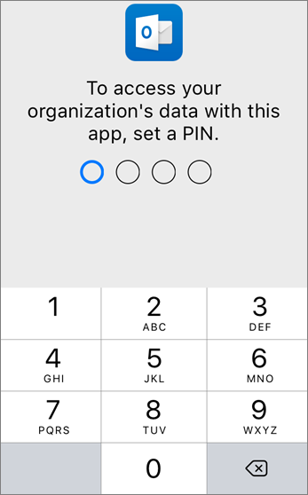
  
## [Android](#tab/Android)
  
Outlook ve Office'i Android cihazlara yükleme hakkında bir video izleyin.  

> [!VIDEO https://www.microsoft.com/videoplayer/embed/ecc2e9c0-bc7e-4f26-8b14-91d84dbcfef0] 

Bu videoyu faydalı bulduysanız, [küçük işletmelere ve Microsoft 365’i ilk kez kullananlara yönelik eğitim serisinin tamamına göz atın](https://support.office.com/article/6ab4bbcd-79cf-4000-a0bd-d42ce4d12816).  

Android telefonunuzda kuruluma başlamak için Play Store'a gidin.
  
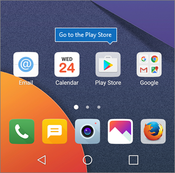
  
Google Play arama kutusuna Microsoft Outlook'u girin ve **Yükle'ye**dokunun. Outlook yüklemeyi bitirdikten sonra **Aç'a**dokunun.
  
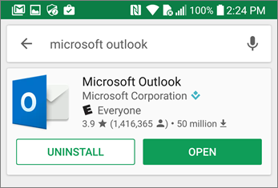
  
Outlook uygulamasında, **Başlat'a**dokunun, ardından iş e-posta \> hesabı için Microsoft 365'inizi ekleyin **ve**kuruluş kimlik bilgilerinizle oturum açın.
  
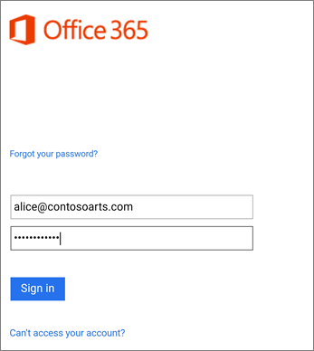
  
Intune Şirket Portalı uygulamasını yüklemeniz gerektiğini belirten iletişim kutusunda **Mağazaya git**'e dokunun.
  
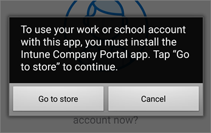
  
Play Store'da Intune Company Portal'ı yükleyin.
  
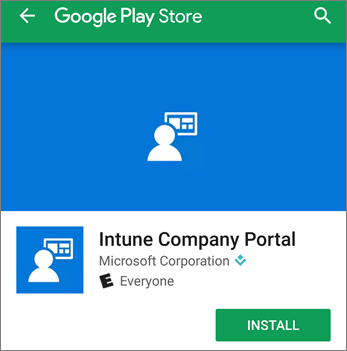
  
Outlook'u yeniden açın, PIN'i girin ve onaylayın. Outlook uygulamanız artık kullanıma hazırdır.
  
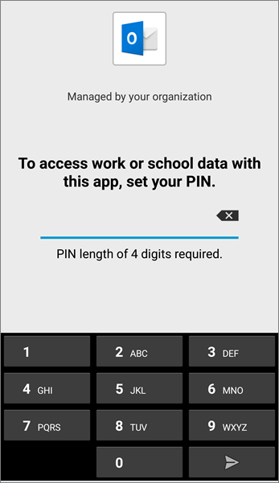

## Ayrıca bkz.

[İş eğitimi videoları için Microsoft 365](https://support.office.com/article/6ab4bbcd-79cf-4000-a0bd-d42ce4d12816)

---
