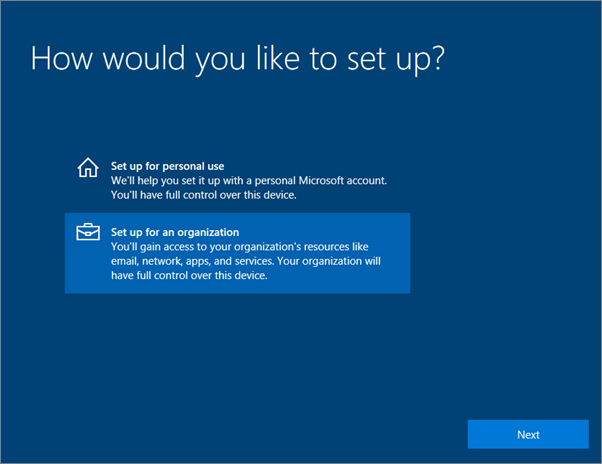
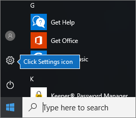
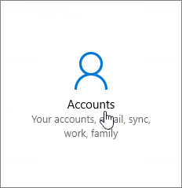
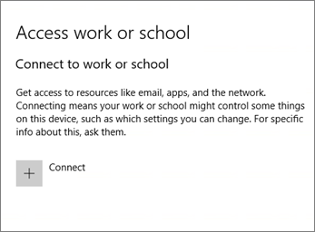
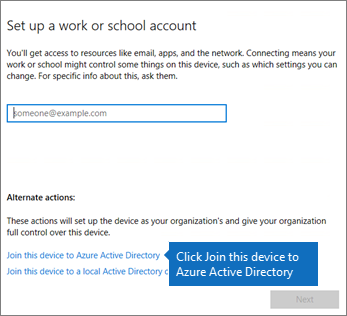
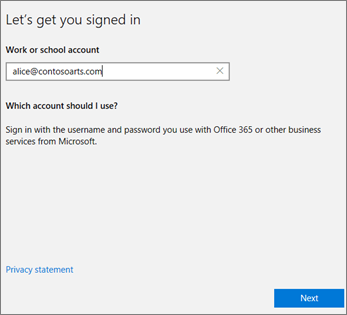
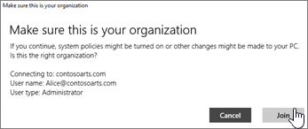
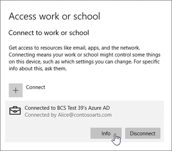
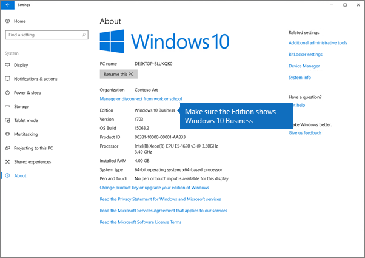

# Microsoft 365 Business Premium kullanıcıları için Windows aygıtları ayarlamaSet up Windows devices for Microsoft 365 Business Premium users

## Microsoft 365 Business Premium kullanıcıları için Windows aygıtları kurmak için ön koşullarPrerequisites for setting up Windows devices for Microsoft 365 Business Premium users

Microsoft 365 Business Premium kullanıcıları için Windows aygıtları ayarlamadan önce, tüm Windows aygıtlarının Windows 10 Pro, sürüm 1703 (Creators Update) çalıştırdığından emin olun.Before you can set up Windows devices for Microsoft 365 Business Premium users, make sure all the Windows devices are running Windows 10 Pro, version 1703 (Creators Update). Windows 10 Pro, Windows 10 Pro'yu tamamlayan ve Microsoft 365 Business Premium'un merkezi yönetim ve güvenlik denetimlerini etkinleştiren bir dizi bulut hizmeti ve aygıt yönetimi özelliği olan Windows 10 Business'ı dağıtmak için bir ön koşuldur.Windows 10 Pro is a prerequisite for deploying Windows 10 Business, which is a set of cloud services and device management capabilities that complement Windows 10 Pro and enable the centralized management and security controls of Microsoft 365 Business Premium.
  
Windows 7 Pro, Windows 8 Pro veya Windows 8.1 Pro çalıştıran Windows aygıtlarınız varsa, Microsoft 365 Business Premium aboneliğiniz size Windows 10 yükseltmesi hakkı verir.If you have Windows devices running Windows 7 Pro, Windows 8 Pro, or Windows 8.1 Pro, your Microsoft 365 Business Premium subscription entitles you to a Windows 10 upgrade.
  
Windows cihazları Windows 10 Pro Creators Update sürümüne yükseltme hakkında daha fazla bilgi için bu konudaki adımları izleyin: [Windows cihazları Windows Pro Creators Update sürümüne yükseltme](upgrade-to-windows-pro-creators-update.md).For more information on how to upgrade Windows devices to Windows 10 Pro Creators Update, follow the steps in this topic: [Upgrade Windows devices to Windows Pro Creators Update](upgrade-to-windows-pro-creators-update.md).
  
Bkz. Yükseltmeye sahip olduğunuzu doğrulamak veya yükseltmenin çalıştığından emin olmak için [aygıtın Azure AD'ye bağlı olduğunu doğrulayın.](#verify-the-device-is-connected-to-azure-ad)See [Verify the device is connected to Azure AD](#verify-the-device-is-connected-to-azure-ad) to verify you have the upgrade, or to make sure the upgrade worked.

Windows'u Microsoft 365'e bağlama hakkında kısa bir video izleyin.Watch a short video about connecting Windows to Microsoft 365.  

> [!VIDEO https://www.microsoft.com/videoplayer/embed/RE3yXh3] 

Bu videoyu faydalı bulduysanız, [küçük işletmelere ve Microsoft 365’i ilk kez kullananlara yönelik eğitim serisinin tamamına göz atın](https://support.office.com/article/6ab4bbcd-79cf-4000-a0bd-d42ce4d12816).If you found this video helpful, check out the [complete training series for small businesses and those new to Microsoft 365](https://support.office.com/article/6ab4bbcd-79cf-4000-a0bd-d42ce4d12816).
  
## Kuruluşunuzun Azure AD'sine Windows 10 cihazlarını eklemeJoin Windows 10 devices to your organization's Azure AD

Kuruluşunuzdaki tüm Windows aygıtları Windows 10 Pro Creators Update'e yükseltilmiş sa veya Windows 10 Pro Creators Update'i zaten çalıştırıyorsa, bu aygıtları kuruluşunuzun Azure Etkin Dizini'ne katılabilirsiniz.When all Windows devices in your organization have either been upgraded to Windows 10 Pro Creators Update or are already running Windows 10 Pro Creators Update, you can join these devices to your organization's Azure Active Directory. Aygıtlar birleştikten sonra, Microsoft 365 Business Premium aboneliğinizin bir parçası olan Windows 10 Business'a otomatik olarak yükseltilir.Once the devices are joined, they'll be automatically upgraded to Windows 10 Business, which is part of your Microsoft 365 Business Premium subscription.
  
### Yeni yükseltilmiş veya yeni bir Windows 10 Pro cihaz içinFor a brand new, or newly upgraded, Windows 10 Pro device

Windows 10 Pro Creators Update çalıştıran yeni bir cihaz için ya da Windows 10 Pro Creators Update sürümüne yükseltilmiş ancak Windows 10 cihaz kurulumu henüz tamamlanmamış bir cihaz için bu adımları izleyin.For a brand new device running Windows 10 Pro Creators Update, or for a device that was upgraded to Windows 10 Pro Creators Update but has not gone through Windows 10 device setup, follow these steps.
  
1. **Nasıl ayarlamak istersiniz?** sayfasına gelene kadar Windows 10 cihaz kurulumu adımlarını tamamlayın.Go through Windows 10 device setup until you get to the **How would you like to set up?** page. 
    
    
  
2. Burada, **bir kuruluş için ayarla'yı** seçin ve ardından Microsoft 365 Business Premium için kullanıcı adınızı ve parolanızı girin.Here, choose **Set up for an organization** and then enter your username and password for Microsoft 365 Business Premium. 
    
3. Windows 10 cihazı kurulumunu tamamlayın.Finish Windows 10 device setup.
    
   İşiniz bittiğinde kullanıcı, kuruluşunuzun Azure AD'sine bağlanmış olur. Emin olmak için bkz. [Cihazın Azure AD'ye bağlı olduğunu doğrulama](#verify-the-device-is-connected-to-azure-ad).Once you're done, the user will be connected to your organization's Azure AD. See [Verify the device is connected to Azure AD](#verify-the-device-is-connected-to-azure-ad) to make sure. 
  
### Önceden ayarlanmış ve Windows 10 Pro çalıştıran bir cihaz içinFor a device already set up and running Windows 10 Pro

 **Kullanıcıları Azure AD'ye bağlama:****Connect users to Azure AD:**
  
1. Kullanıcınızın Windows 10 Pro sürüm 1703 (Creators Update) (bkz. [önkoşullar](pre-requisites-for-data-protection.md)) çalıştıran Windows bilgisayarında, Windows logosuna ve ardından Ayarlar simgesine tıklayın.In your user's Windows PC, that is running Windows 10 Pro, version 1703 (Creators Update) (see [pre-requisites](pre-requisites-for-data-protection.md)), click the Windows logo, and then the Settings icon.
  
   
  
2. **Ayarlar**'da **Hesaplar**'a gidin.In **Settings**, go to **Accounts**.
  
   
  
3. **Bilgileriniz** sayfasında **İş yeri veya okula erişim** \> **Bağlan**'a tıklayın.On **Your info** page, click **Access work or school** \> **Connect**.
  
   
  
4. **İş veya okul hesabı ayarlama** iletişim kutusunda **Diğer eylemler**'in altında **Bu cihazı Azure Active Directory'ye ekleyin**'i seçin.On the **Set up a work or school account** dialog, under **Alternate actions**, choose **Join this device to Azure Active Directory**.
  
   
  
5. On the **Let's get you signed in** page, enter your work or school account \> **Next**.On the **Let's get you signed in** page, enter your work or school account \> **Next**.
  
   On the **Enter password** page, enter your password \> **Sign in**.On the **Enter password** page, enter your password \> **Sign in**.
  
   
  
6. Bunun **kuruluş sayfanız olduğundan emin olun,** bilgilerin doğru olduğundan emin olun ve **Katıl'ı**tıklatın.On the **Make sure this is your organization** page, verify that the information is correct, and click **Join**.
  
   **Hazırsınız!** sayfasında **Bitti**'ye tıklayın.On the **You're all set!** page, click **Done**.
  
   
  
OneDrive İş'e dosya yüklediyseniz, bunları tekrar eşitleyin.If you uploaded files to OneDrive for Business, sync them back down. Profili ve dosyaları geçirmek için bir üçüncü taraf aracı kullandıysanız, bunları yeni profille de eşitleyin.If you used a third-party tool to migrate profile and files, also sync those to the new profile.
  
## Cihazın Azure AD'ye bağlı olduğunu doğrulamaVerify the device is connected to Azure AD

**Eşitleme**durumunuzu doğrulamak için Ayarlar'daki **Access çalışmasında veya okul** sayfasında , Bilgi ve Bağlantı kesme düğmelerini ortaya çıkarmak için _ _ alanına **Bağlı'yı** \<organization name\> **Info** tıklatın. **Disconnect**To verify your sync status, on the **Access work or school** page in **Settings**, click in the **Connected to** _ \<organization name\> _ area to expose the buttons **Info** and **Disconnect**. Eşitleme durumunuzu görmek için **Bilgi**'ye tıklayın.Click on **Info** to get your synchronization status. 
  
En son mobil cihaz yönetimi ilkelerini bilgisayara aktarmak için, Eşitleme durumu sayfasında Eşitle'ye tıklayın.On the Sync status page, click Sync to get the latest mobile device management policies onto the PC.
  
Microsoft 365 Business Premium hesabını kullanmaya başlamak için Windows **Start** düğmesine gidin, geçerli hesap resminize sağ tıklayın ve ardından **hesabı değiştirin.**To start using the Microsoft 365 Business Premium account, go to the Windows **Start** button, right-click your current account picture, and then **Switch account**. Kurumsal e-postanız ve parolanızla oturum açın.Sign in by using your organization email and password.
  

  
## Cihazın Windows 10 Business'a yükseltildiğini doğrulamaVerify the device is upgraded to Windows 10 Business

Azure AD'nizin Windows 10'a katıldığını doğrulayın, Microsoft 365 Business Premium aboneliğinizin bir parçası olarak Windows 10 Business'a yükseltildi.Verify that your Azure AD joined Windows 10 devices were upgraded to Windows 10 Business as part of your Microsoft 365 Business Premium subscription.
  
1. **Ayarlar** \> **Sistem** \> **Hakkında**'ya gidin.Go to **Settings** \> **System** \> **About**.
    
2. **Sürüm** bölümünde **Windows 10 Business** ifadesinin bulunduğunu doğrulayın.Confirm that the **Edition** shows **Windows 10 Business**.
    
    
  
## Sonraki adımlarNext steps

Mobil cihazlarınızı ayarlamak için bkz: [Microsoft 365 Business Premium kullanıcıları için mobil cihazlar ayarla](set-up-mobile-devices.md), Cihaz koruma veya uygulama koruma ilkeleri ayarlamak [için, iş için Microsoft 365'i yönet'e](manage.md)bakın.To set up your mobile devices, see [Set up mobile devices for Microsoft 365 Business Premium users](set-up-mobile-devices.md), To set device protection or app protection policies, see [Manage Microsoft 365 for business](manage.md).
  
## Microsoft 365 Business Premium'u kurma ve kullanma hakkında daha fazla şey içinFor more on setting up and using Microsoft 365 Business Premium

[İş eğitimi videoları için Microsoft 365Microsoft 365 for business training videos](https://support.office.com/article/6ab4bbcd-79cf-4000-a0bd-d42ce4d12816)
