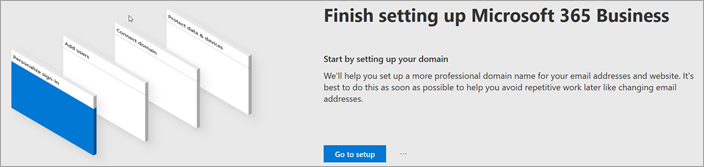
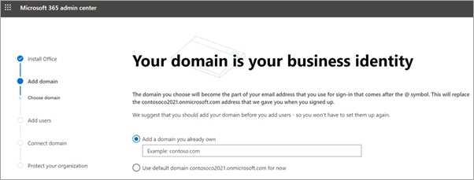
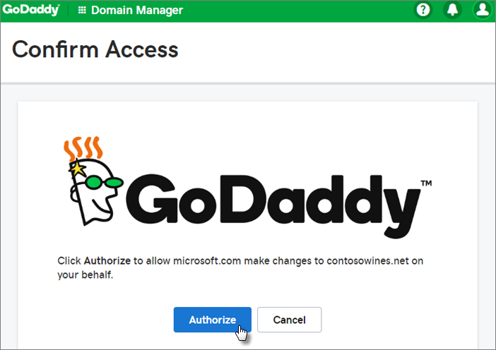
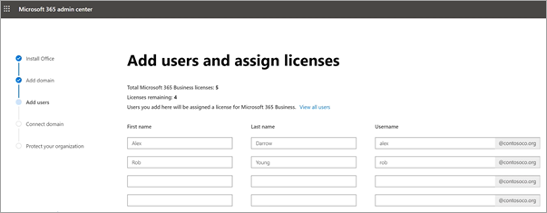
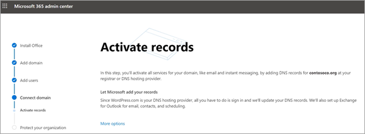
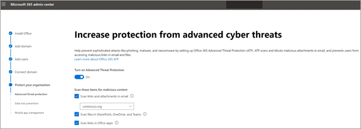
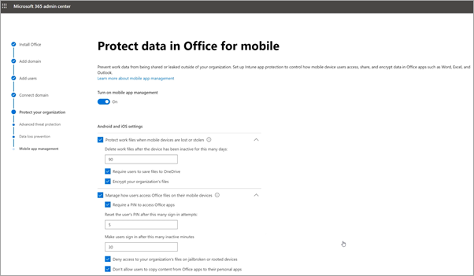

# Kurulum sihirbazında Microsoft 365 İş Ekstra'ya ayarlamaSet up Microsoft 365 Business Premium in the setup wizard

Microsoft 365 İş Ekstra kurulumuna genel bakış için bu videoyu izleyin.Watch this video for an overview of Microsoft 365 Business Premium setup.  

> [!VIDEO https://www.microsoft.com/videoplayer/embed/RE4jZwg] 

## Etki alanınızı, kullanıcılarınızı ekleme ve ilkeleri ayarlamaAdd your domain, users, and set up policies

Microsoft 365 İş Ekstra'ı satın alırken, sahip olduğunuz bir etki alanını kullanma veya kayıt sırasında bir etki alanı [satın alma seçeneğiniz vardır.](sign-up.md)When you purchase Microsoft 365 Business Premium, you have the option of using a domain you own, or buying one during the [sign-up](sign-up.md).

- Kayıt olurken yeni bir etki alanı satın aldıysanız, etki alanınız ayarlanmıştır ve Kullanıcı ekle'ye geçebilirsiniz [ve lisans atabilirsiniz.](#add-users-and-assign-licenses)If you purchased a new domain when you signed up, your domain is all set up and you can move to [Add users and assign licenses](#add-users-and-assign-licenses).

### Oturum açmanızı kişiselleştirmek için etki alanınızı eklemeAdd your domain to personalize sign-in

1. Genel yönetici [kimlik bilgilerinizi kullanarak Microsoft 365](https://admin.microsoft.com) yönetim merkezinde oturum açma.Sign in to [Microsoft 365 admin center](https://admin.microsoft.com) by using your global admin credentials. 

2. Sihirbazı **başlatmak için Kuruluma** git'i seçin.Choose **Go to setup** to start the wizard.

    

3. Office **uygulamalarınızı yükleyin sayfasında,** isteğe bağlı olarak uygulamaları kendi bilgisayarınıza yükleyebilirsiniz.On the **Install your Office apps** page, you can optionally install the apps on your own computer.
    
4. Etki alanı **ekle adımlarında,** kullanmak istediğiniz etki alanı adını girin (örneğin, contoso.com).In the **Add domain** step, enter the domain name you want to use (like contoso.com).

    > [!IMPORTANT]
    > Kayıt sırasında bir etki alanı satın yaptıysanız, Buraya etki alanı ekle **adımını** görmeyebilirsiniz.If you purchased a domain during the sign-up, you will not see **Add a domain** step here. Bunun yerine [Kullanıcı ekle'ye](#add-users-and-assign-licenses) gidin.Go to [Add users](#add-users-and-assign-licenses) instead.

    

    
4. [Microsoft 365](/office365/admin/get-help-with-domains/create-dns-records-at-any-dns-hosting-provider) için etki alanının sahibinizi doğrulayanın herhangi bir DNS barındırma sağlayıcısında DNS kayıtları oluşturmak için sihirbazda yer alan adımları izleyin.Follow the steps in the wizard to [Create DNS records at any DNS hosting provider for Microsoft 365](/office365/admin/get-help-with-domains/create-dns-records-at-any-dns-hosting-provider) that verifies you own the domain. Etki alanı ana nızı biliyorsanız, ana bilgisayarla ilgili [yönergelere de bakın.](/office365/admin/get-help-with-domains/set-up-your-domain-host-specific-instructions)If you know your domain host, see also the [host specific instructions](/office365/admin/get-help-with-domains/set-up-your-domain-host-specific-instructions).

    Barındırma sağlayıcınız GoDaddy veya etki alanı bağlantısıyla etkinleştirilmiş başka bir ana bilgisayarsa, işlem kolaydır ve otomatik olarak oturum açmalı ve Sizin adınıza Microsoft'un kimlik doğrulamasına izin vermeniz istenmektedir.If your hosting provider is GoDaddy or another host enabled with [domain connect](/office365/admin/get-help-with-domains/domain-connect), the process is easy and you'll be automatically asked to sign in and let Microsoft authenticate on your behalf.

    

### Kullanıcı ekleme ve lisans atamaAdd users and assign licenses

Sihirbaza kullanıcı eklemekle birlikte, kullanıcıları daha [sonra yönetim merkezinden](../admin/add-users/add-users.md) de eklemeniz de gerekir.You can add users in the wizard, but you can also [add users later](../admin/add-users/add-users.md) in the admin center. Buna ek olarak, yerel bir etki alanı denetleyiciniz [varsa, Azure AD Connect'i olan kullanıcıları ekleyebilirsiniz.](/azure/active-directory/hybrid/how-to-connect-install-express)Additionally, if you have a local domain controller, you can add users with [Azure AD Connect](/azure/active-directory/hybrid/how-to-connect-install-express).

#### Sihirbaza kullanıcı eklemeAdd users in the wizard

Sihirbaza ekley istediğiniz kullanıcılara otomatik olarak bir Microsoft 365 İş Ekstra lisansı atanır.Any users you add in the wizard get automatically assigned a Microsoft 365 Business Premium license.

1. Microsoft 365 İş Ekstra aboneliğinizin mevcut kullanıcıları varsa (örneğin, Azure AD Connect kullandınız), bu kullanıcılara şimdi lisans atama seçeneğiniz olur.If your Microsoft 365 Business Premium subscription has existing users (for example, if you used Azure AD Connect), you get an option to assign licenses to them now. Bu kullanıcılara da lisans ekleyerek işleme devam edin.Go ahead and add licenses to them as well.

2. Kullanıcıları ekledikten sonra, kimlik bilgilerini kendi ekledikten sonra yeni kullanıcılarla paylaşma seçeneği de elde olur.After you've added the users, you'll also get an option to share credentials with the new users you added. Bunları yazdırabilir, e-posta ile gönderebilir veya indirebilirsiniz.You can choose to print them out, email them, or download them.

### Etki alanınızı bağlamaConnect your domain

> [!NOTE]
> Kullanıcıları ayarlamak için .onmicrosoft etki alanını kullanmayı seçtiy veya Azure AD Connect'i kullandınız, bu adımı görmeyebilirsiniz.If you chose to use the .onmicrosoft domain, or used Azure AD Connect to set up users, you will not see this step.
  
Hizmetleri ayarlamak için DNS ana bilgisayarınızda veya etki alanı kayıt şirketinizde bazı kayıtları güncelleştirmeniz gerekir.To set up services, you have to update some records at your DNS host or domain registrar.
  
1. Kurulum sihirbazı, genellikle kayıt şirketinizi algılar ve kayıt şirketinin web sitesinde NS kayıtlarınızı güncelleştirmek için adım adım yönergelere ulaşabileceğiniz bir bağlantı verir.The setup wizard typically detects your registrar and gives you a link to step-by-step instructions for updating your NS records at the registrar website. Bunu bilmiyorsa, Microsoft [365'i](../admin/get-help-with-domains/change-nameservers-at-any-domain-registrar.md)herhangi bir etki alanı kayıt şirketiyle ayarlamak için ad sunucularını değiştirme.If it doesn't, [Change nameservers to set up Microsoft 365 with any domain registrar](../admin/get-help-with-domains/change-nameservers-at-any-domain-registrar.md). 

    - Mevcut DNS kayıtlarınız, örneğin var olan bir web siteniz varsa, ancak etki alanı bağlantısı için DNS barındırma etkinleştirilmişse, Kayıtları benim için **ekle'yi seçin.**If you have existing DNS records, for example an existing web site, but your DNS host is enabled for [domain connect](/office365/admin/get-help-with-domains/domain-connect), choose **Add records for me**. Çevrimiçi **hizmetlerinizi seçin sayfasında,** tüm varsayılanları kabul edin ve  Sonraki'ni seçin ve DNS barındırma barındırma hizmet nizin sayfasında Yetkilendir'i seçin.On the **Choose your online services** page, accept all the defaults, and choose **Next**, and choose **Authorize** on your DNS host's page.
    - Diğer DNS ana bilgisayarlarında var olan DNS kayıtlarınız varsa (etki alanı bağlantısı için etkin değil), mevcut hizmetlerin bağlı kalacağından emin olmak için kendi DNS kayıtlarınızı yönetmek istemeniz gerekir.If you have existing DNS records with other DNS hosts (not enabled for domain connect), you'll want to manage your own DNS records to make sure the existing services stay connected. Daha [fazla bilgi için etki alanı](/office365/admin/get-help-with-domains/dns-basics) temel bilgilerine bakın.See [domain basics](/office365/admin/get-help-with-domains/dns-basics) for more info.

        

2. Sihirbazda adımları izleyin; e-posta ve diğer hizmetler sizin için ayarlanır.Follow the steps in the wizard and email and other services will be set up for you.

### Organizasyonlarınızı koruyunProtect your organization 

Sihirbazda ayarlanıyor olan ilkeler, Tüm Kullanıcılar adlı [Güvenlik grubuna otomatik](/office365/admin/create-groups/compare-groups#security-groups) olarak *uygulanır.*The policies you set up in the wizard are applied automatically to a [Security group](/office365/admin/create-groups/compare-groups#security-groups) called *All Users*. Ayrıca, yönetim merkezinde ilke atamak için ek gruplar da oluşturabilirsiniz.You can also create additional groups to assign policies to in the admin center.

1. Gelişmiş siber **tehditlere karşı** korumayı artırarak, [Office 365'in](../security/office-365-security/defender-for-office-365.md) Tehdit Koruması'nın Office uygulamalarına dosya ve bağlantı taramasına izin verme varsayılanlarını kabul etmenizi öneririz.On the **Increase protection from advanced cyber threats**, it is recommended that you accept the defaults to let [Office 365 Advance Threat Protection](../security/office-365-security/defender-for-office-365.md) scan files and links in Office apps.

    

2. Hassas veri **sızıntılarını** önle sayfasında, Office uygulamaları içinde hassas verileri izlemek ve bunların kuruluş dışında yanlışlıkla paylaşımını önlemek için Office 365 Veri Kaybı Önleme'nin (DLP) varsayılanlarını kabul edin.On the **Prevent leaks of sensitive data** page, accept the defaults to turn on Office 365 Data Loss Prevention (DLP) to track sensitive data in Office apps and prevent the accidental sharing of these outside your organization.

3. Mobil cihazlar **için Office'te** verileri koru sayfasında, mobil uygulama yönetimini açık bırakın, ayarları genişletin ve gözden geçirin ve ardından Mobil uygulama **yönetimi ilkesi oluştur'a tıklayın.**On the **Protect data in Office for mobile** page, leave mobile app management on, expand the settings and review them, and then select **Create mobile app management policy**.

    

## Windows 10 bilgisayarlarında güvenlik sağlamaSecure Windows 10 PCs

Sol gezintide Kurulum'u **seçin** ve ardından Oturum açma ve güvenlik altında Windows **10** bilgisayarlarınızı güvenli hale seçin.On the left nav, select **Setup** and then, under **Sign-in and security**, choose **Secure your Windows 10 computers**. Başlamak **için** Görüntüle'yi seçin.Choose **View** to get started. Eksiksiz [yönergeler için Windows 10 bilgisayarlarınızı](secure-win-10-pcs.md) güvenli hale bakın.See [secure your Windows 10 computers](secure-win-10-pcs.md) for complete instructions.

## Office 365 istemci uygulamalarını dağıtmaDeploy Office 365 client apps

Kurulum sırasında Office uygulamalarını otomatik olarak yüklemeyi tercih edersiniz, kullanıcılar Windows cihazlarından Azure AD'de oturum açmaları için iş kimlik bilgilerini kullanarak Windows 10 cihazlarına yüklenir.If you chose to automatically install Office apps during setup, the apps will install on the Windows 10 devices once the users have signed in to Azure AD from their Windows devices, using their work credentials.

Office'i mobil iOS veya Android cihazlara yüklemek için Bkz. [Microsoft 365 İş Ekstra](set-up-mobile-devices.md)kullanıcıları için mobil cihazları ayarlama.To install Office on mobile iOS or Android devices, see [Set up mobile devices for Microsoft 365 Business Premium users](set-up-mobile-devices.md).

Office'i tek tek de yükleyebilirsiniz.You can also install Office individually. Yönergeler [için BKZ. PC veya Mac bilgisayara Office](https://support.microsoft.com/office/4414eaaf-0478-48be-9c42-23adc4716658) yükleme.See [install Office on a PC or Mac](https://support.microsoft.com/office/4414eaaf-0478-48be-9c42-23adc4716658) for instructions.

## Ayrıca bk.See also

[İş için Microsoft 365 eğitim videolarıMicrosoft 365 for business training videos](https://support.microsoft.com/office/6ab4bbcd-79cf-4000-a0bd-d42ce4d12816)
