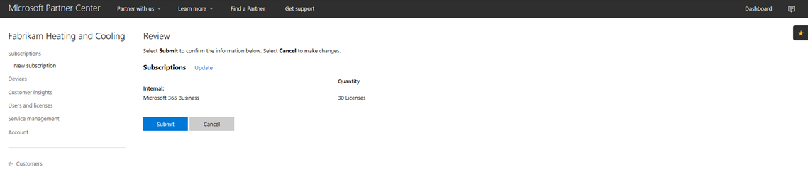
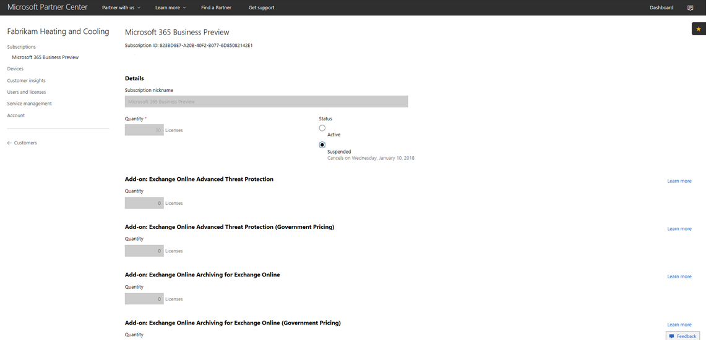
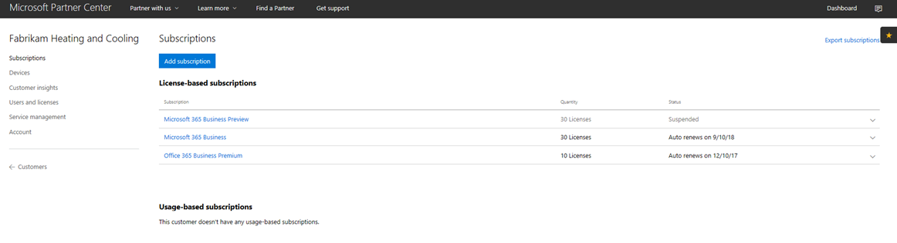
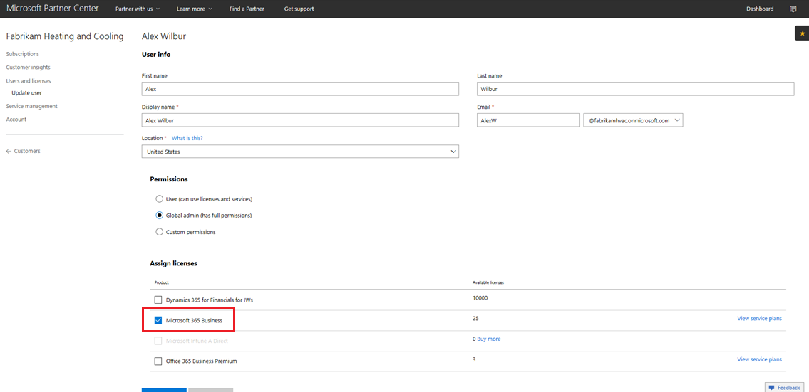

# Microsoft 365 Business CSP aboneliğine geçişTransition a Microsoft 365 Business CSP subscription

Microsoft 365 Business Preview CSP aboneliğiniz varsa, mevcut önizleme aboneliğinizi Microsoft 365 Business GA'ya (genel kullanılabilirlik) nasıl geçirebileceğinizi öğrenmek için bu kılavuzu izleyin.If you have a Microsoft 365 Business Preview CSP subscription, follow this guide to find out how you can transition your existing preview subscription to Microsoft 365 Business GA (general availability).

**Önizleme aboneliğini GA'ya aktarma****How to transition a preview subscription to GA**

1. <a href="https://partnercenter.microsoft.com" target="_blank">Ortak Merkezi'nde</a>oturum açın.Sign in to <a href="https://partnercenter.microsoft.com" target="_blank">Partner Center</a>.
2. Panondan **Müşteriler'i**seçin ve ardından şirket adını bulup seçin.From the dashboard, select **Customers**, and then find and select the company name.

    Şirket abonelikleri listelenecektir.The subscriptions for the company will be listed.

    
    
3. Şirketin **Abonelikler** sayfasında **abonelik ekle'yi**seçin.On the company's **Subscriptions** page, select **Add subscription**.
4. Yeni **abonelik** sayfasında Küçük **Işletme'yi** seçin ve ardından listeden **Microsoft 365 Business'ı** seçin.On the **New subscription** page, select **Small business** and then select **Microsoft 365 Business** from the list.
5. Lisans sayısını ekleyin ve ardından **Sonraki'ni seçin:** Aboneliği gözden geçirmek için gözden geçirin ve ardından **Gönder'i**seçin.Add the number of licenses and then select **Next: Review** to review the subscription and then select **Submit**.

    

    **Lisans tabanlı abonelikler** **Microsoft 365 Business Preview** ve Microsoft **365 Business'ı**gösterir.The **License-based subscriptions** will show **Microsoft 365 Business Preview** and **Microsoft 365 Business**. Daha sonra Önizleme aboneliğini askıya alabilirsiniz.You'll suspend the Preview subscription next.

6. **Microsoft 365 İş Önizleme'yi**seçin.Select **Microsoft 365 Business Preview**.
7. Microsoft **365 İş Önizleme** sayfasında, Önizleme aboneliğini askıya almak için **Askıya Alın'ı** seçin.On the **Microsoft 365 Business Preview** page, select **Suspended** to suspend the Preview subscription.

    

8. Onaylamak için **Gönder'i** seçin.Select **Submit** to confirm.

    **Abonelikler** sayfasında, **Microsoft 365 İş Önizleme** durumunun Askıya **Alındığını**gösterdiğini doğrulayın.On the **Subscriptions** page, confirm that the **Microsoft 365 Business Preview** status shows **Suspended**.

    

9. İsteğe bağlı olarak, lisans sözleşmesini de doğrulayabilirsiniz.Optionally, you can also validate the license agreement. Bunu yapmak için aşağıdaki adımları izleyin:To do this, follow these steps:
    1. Şirketin **Abonelikler** sayfasından **Kullanıcıları ve lisansları** seçin.Select **Users and licenses** from the company's **Subscriptions** page.
    2. Kullanıcılar **ve lisanslar** sayfasında bir kullanıcı seçin.On the **Users and licenses** page, select a user.
    3. Kullanıcının sayfasında, **Lisansları Atla** bölümünü kontrol edin ve **Microsoft 365 Business'ı**gösterdiğini onaylayın.On the user's page, check the **Assign licenses** section and confirm that it shows **Microsoft 365 Business**.

        

## Geçiş sırasında ve sonrasında müşterilere ve kullanıcılara etkiImpact to customers and users during and after transition

Geçiş ve geçiş sonrası sırasında müşteriler ve kullanıcılar üzerinde hiçbir etkisi yoktur.There's no impact to customers and users during transition and post transition.

## Geçiş yapmayan müşterilere etkiImpact to customers who don't transition

Aşağıdaki tablo, Microsoft 365 İş Önizleme aboneliğinden Microsoft 365 İş aboneliğine geçmeyen müşterilerin etkisini özetleyilmiştir.The following table summarizes the impact to customers who don't transition from a Microsoft 365 Business Preview subscription to a Microsoft 365 Business subscription.

|       | T-0 - T+30T-0 to T+30     | T+30 ile T+60 arasıT+30 to T+60 | T+60 ile T+120 arasındaT+60 to T+120 | T+120'nin ÖtesindeBeyond T+120  |
|-------|-----------------|--------------|---------------|---------------|
| **Durum****State** | Yetkisiz kullanım süresi içindeIn grace period | Süresi dolmuşExpired      | Devre dışıDisabled      | Hükmün iptaliDeprovisioned |
| **Hizmet etkileri****Service impacts**                                                        |
| **Microsoft 365 İş yönetici portalı****Microsoft 365 Business admin portal** | İşlevsellik üzerinde etkisi yokturNo impact to functionality | İşlevsellik üzerinde etkisi yokturNo impact to functionality | Kullanıcı ekleyebilir/silebilir, abonelik satın alabilir.Can add/delete users, purchase subscriptions.  Lisans atama/iptal edemez.Can't assign/revoke licenses. | Müşterinin aboneliği ve tüm veriler silinir.Customer's subscription and all data is deleted. Yönetici diğer ücretli abonelikleri yönetebilir.Admin can manage other paid subscriptions. |
| **Office uygulamaları****Office apps**                         | Son kullanıcı etkisi yokNo end user impact | Son kullanıcı etkisi yokNo end user impact | Office azaltılmış işlevsellik moduna girer.Office enters reduced functionality mode.  Kullanıcılar yalnızca dosyaları görüntüleyebilir.Users can view files only. | Office azaltılmış işlevsellik moduna girer.Office enters reduced functionality mode.  Kullanıcılar yalnızca dosyaları görüntüleyebilir.Users can view files only. |
| **Bulut hizmetleri (SharePoint Online, Exchange Online, Skype, Takımlar ve daha fazlası)****Cloud services (SharePoint Online, Exchange Online, Skype, Teams, and more)** | Son kullanıcı etkisi yokNo end user impact | Son kullanıcı etkisi yokNo end user impact | Son kullanıcılar ve yöneticiler buluttaki verilere erişemez.End users and admins have no access to data in the cloud. | Müşterinin aboneliği ve tüm veriler silinir.Customer's subscription and all data are deleted. |
| **EM+S bileşenleri****EM+S components** | Yönetici etkisi yokNo admin impact  Son kullanıcı etkisi yokNo end user impact | Yönetici etkisi yokNo admin impact  Son kullanıcı etkisi yokNo end user impact | Yetenek artık zorlanmadı.Capability is no longer enforced.  Daha fazla bilgi için [abonelik sona ermesisırasında Mobil cihaz üzerindeki etkilerine](#mobile-device-impacts-upon-subscription-expiration) ve [Windows 10 PC'nin abonelik sona ermesinden](#windows-10-pc-impacts-upon-subscription-expiration) etkilenmeye yönelik etkilerine bakın.See [Mobile device impacts upon subscription expiration](#mobile-device-impacts-upon-subscription-expiration) and [Windows 10 PC impacts upon subscription expiration](#windows-10-pc-impacts-upon-subscription-expiration) for more info. | Yetenek artık zorlanmadı.Capability is no longer enforced.  Daha fazla bilgi için [abonelik sona ermesisırasında Mobil cihaz üzerindeki etkilerine](#mobile-device-impacts-upon-subscription-expiration) ve [Windows 10 PC'nin abonelik sona ermesinden](#windows-10-pc-impacts-upon-subscription-expiration) etkilenmeye yönelik etkilerine bakın.See [Mobile device impacts upon subscription expiration](#mobile-device-impacts-upon-subscription-expiration) and [Windows 10 PC impacts upon subscription expiration](#windows-10-pc-impacts-upon-subscription-expiration) for more info. |
| **Windows 10 İş****Windows 10 Business** | Yönetici etkisi yokNo admin impact  Son kullanıcı etkisi yokNo end user impact | Yönetici etkisi yokNo admin impact  Son kullanıcı etkisi yokNo end user impact | Yetenek artık zorlanmadı.Capability is no longer enforced.  Daha fazla bilgi için [abonelik sona ermesisırasında Mobil cihaz üzerindeki etkilerine](#mobile-device-impacts-upon-subscription-expiration) ve [Windows 10 PC'nin abonelik sona ermesinden](#windows-10-pc-impacts-upon-subscription-expiration) etkilenmeye yönelik etkilerine bakın.See [Mobile device impacts upon subscription expiration](#mobile-device-impacts-upon-subscription-expiration) and [Windows 10 PC impacts upon subscription expiration](#windows-10-pc-impacts-upon-subscription-expiration) for more info. | Yetenek artık zorlanmadı.Capability is no longer enforced.  Daha fazla bilgi için [abonelik sona ermesisırasında Mobil cihaz üzerindeki etkilerine](#mobile-device-impacts-upon-subscription-expiration) ve [Windows 10 PC'nin abonelik sona ermesinden](#windows-10-pc-impacts-upon-subscription-expiration) etkilenmeye yönelik etkilerine bakın.See [Mobile device impacts upon subscription expiration](#mobile-device-impacts-upon-subscription-expiration) and [Windows 10 PC impacts upon subscription expiration](#windows-10-pc-impacts-upon-subscription-expiration) for more info. |
| **Windows 10 bilgisayara Azure AD girişi****Azure AD login to a Windows 10 PC** | Yönetici etkisi yokNo admin impact  Son kullanıcı etkisi yokNo end user impact | Yönetici etkisi yokNo admin impact  Son kullanıcı etkisi yokNo end user impact | Yönetici etkisi yokNo admin impact  Son kullanıcı etkisi yokNo end user impact | Kiracı silindikten sonra, kullanıcı yalnızca yerel kimlik bilgileriyle oturum açabilir.Once the tenant is deleted, a user can sign in with local credentials only. Yerel kimlik bilgileri yoksa aygıtı yeniden görüntüleyin.Re-image the device if there are no local credentials. |

## Mobil cihaz abonelik süresi nin sona ermesinden sonra etkilerMobile device impacts upon subscription expiration

Aşağıdaki tablo, uygulama yönetimi politikalarının mobil cihazlar üzerindeki etkisini özetlemektedir.The following table summarizes the impact to the app management policies on mobile devices.

|                            | Tam lisanslı deneyimFully licensed experience                      | T+60 gün sonrası sona ermeT+60 days post expiration          |
|----------------------------|------------------------------------------------|------------------------------------|
| **Etkin olmayan bir aygıttan çalışma dosyalarını silme****Delete work files from an inactive device** | Çalışma dosyaları seçili günden sonra kaldırılırWork files are removed after selected days | Çalışma dosyaları kullanıcının kişisel cihazlarında kalırWork files remain on the user's personal devices |
| **Tüm kullanıcıları iş dosyalarını OneDrive İş üzerine kaydetmeye zorla****Force users to save all work files to OneDrive for Business** | Çalışma dosyaları yalnızca İş Için OneDrive'a kaydedilebilirWork files can only be saved to OneDrive for Business | Çalışma dosyaları her yere kaydedilebilirWork files can be saved anywhere |
| **İş dosyalarını şifrele****Encrypt work files** | Çalışma dosyaları şifrelenirWork files are encrypted | Çalışma dosyaları artık şifrelenmez.Work files are no longer encrypted.  Güvenlik ilkeleri kaldırılır ve uygulamalardaki Office verileri kaldırılır.Security policies are removed and Office data on apps is removed. |
| **Office uygulamalarına erişmek için PIN veya parmak izi gerektirme****Require PIN or fingerprint to access Office apps** | Uygulamalara kısıtlı erişimRestricted access to apps | Uygulama düzeyinde erişim kısıtlaması yokNo app-level access restriction |
| **Oturum açma başarısız olduğunda PIN'i sıfırlama****Reset PIN when login fails** | Uygulamalara kısıtlı erişimRestricted access to apps | Uygulama düzeyinde erişim kısıtlaması yokNo app-level access restriction |
| **Office uygulamaları boşta kaldıktan sonra kullanıcıların yeniden oturum açmalarını zorunlu kılmasını zorunlu kılmasını****Require users to sign in again after Office apps have been idle** | Oturum açma gerekliSign-in required | Oturum açma gerekli değildirNo sign-in required |
| **İşletim sistemi kısıtlamaları kaldırılmış veya kök erişim izni verilmiş cihazlardan iş dosyalarına erişilmesini engelle****Deny access to work files on jailbroken or rooted devices** | Çalışma dosyalarına jailbroken/rooted cihazlarda erişilenemiyorWork files can't be accessed on jailbroken/rooted devices | Çalışma dosyalarına jailbroken/rooted cihazlarda erişilebilirWork files can be accessed on jailbroken/rooted devices |
| **Kullanıcıların Office uygulamalarından Kişisel uygulamalara içerik kopyalamasına izin verme****Allow users to copy content from Office apps to Personal apps** | Microsoft 365 aboneliğinin bir parçası olarak kullanılabilen uygulamalarla sınırlı kopyalama/yapıştırCopy/paste restricted to apps available as part of Microsoft 365 subscription | Tüm uygulamaların kullanabileceği kopyalama/yapıştırCopy/paste available to all apps |

## Windows 10 PC abonelik sona erme sırasında etkilerWindows 10 PC impacts upon subscription expiration

Aşağıdaki tablo, Windows 10 aygıt yapılandırma ilkelerine etkisini özetleyin.The following table summarizes the impact to the Windows 10 device configuration policies.

|                            | Tam lisanslı deneyimFully licensed experience                      | T+60 gün sonrası sona ermeT+60 days post expiration          |
|----------------------------|------------------------------------------------|------------------------------------|
| **Windows Defender'ı kullanarak bilgisayarların tehditlere karşı korunmasına yardımcı olun****Help protect PCs from threats using Windows Defender** | Açma/kapatma kullanıcı denetiminin dışındadırTurn on/off is outside of user control | Kullanıcı Windows 10 pc'de Windows Defender'ı açabilir/kapatabilirUser can turn on/off Windows Defender on the Windows 10 PC |
| **Bilgisayarları Microsoft Edge'de web tabanlı tehditlere karşı korumaya yardımcı ol****Help protect PCs from web-based threats in Microsoft Edge** | Microsoft Edge'de PC korumasıPC protection in Microsoft Edge | Kullanıcı Microsoft Edge'de PC korumayı açabilir/kapatabilirUser can turn on/off PC protection in Microsoft Edge |
| **Boştayken cihaz ekranLarını kapatma****Turn off device screen when idle** | Yönetici ekran zaman aralığı ilkesini tanımlarAdmin defines screen timeout interval policy | Ekran zaman sonu son kullanıcıya göre yapılandırılabilirScreen timeout can be configured by end user |
| **Kullanıcıların Microsoft Store'ndan uygulama indirmesine izin ver****Allow users to download apps from Microsoft Store** | Yönetici, bir kullanıcının Microsoft Mağazası'ndan uygulama indirip indiremeyebileceğini tanımlarAdmin defines if a user can download apps from Microsoft Store | Kullanıcı uygulamaları Microsoft Mağazası'ndan her zaman indirebilirUser can download apps from Microsoft Store anytime |
| **Kullanıcıların Cortana'ya erişmesine izin ver****Allow users to access Cortana** | Yönetici Cortana kullanıcı erişimi ilkesi tanımlarAdmin defines policy on user access to Cortana | Cortana'yı açmak/kapatmak için kullanıcı aygıtlarıUser devices to turn on/off Cortana |
| **Kullanıcıların Microsoft'tan ipuçları ve reklamlar almasına izin verme****Allow users to receive tips and advertisements from Microsoft** | Yönetici Microsoft'tan kullanıcı alma ipuçları ve reklamlar ilke tanımlarAdmin defines policy on user receive tips and advertisements from Microsoft | Kullanıcı, Microsoft'un ipuçlarını ve reklamlarını açabilir/kapatabilirUser can turn on/off tips and advertisements from Microsoft |
| **Kullanıcıların Office uygulamalarından kişisel uygulamalara içerik kopyalamasına izin ver****Allow users to copy content from Office apps into personal apps** | Yönetici, Windows 10 aygıtlarını güncel tutmak için ilke tanımlarAdmin defines policy to keep Windows 10 devices up to date | Kullanıcılar Windows'u ne zaman güncelleştireceklerine karar verebilirUsers can decide when to update Windows |
