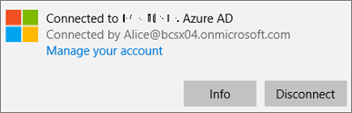
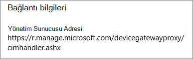
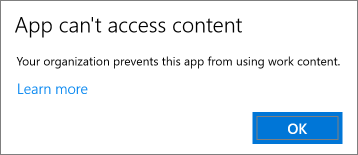
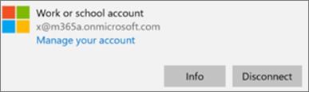
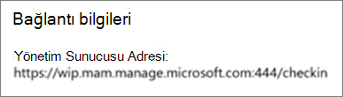

# Windows 10 bilgisayarlarda uygulama koruma ayarlarını doğrulamaValidate app protection settings on Windows 10 PCs

## Kullanıcıların şirket cihazlarındaki kişisel dosyalarına şirket verilerini kopyalayamadıklarını doğrulamaVerify that users cannot copy company data to personal files on corporate devices

[Uygulama koruma ilkelerini ayarladıktan](protection-settings-for-windows-10-devices.md) sonra, ilkenin kullanıcı cihazlarında geçerlilik kazanması birkaç saat sürebilir.After you [set up app protection policies](protection-settings-for-windows-10-devices.md), it may take up to a few hours for the policy to take effect on users' devices. Kullanıcıların şirket verilerini kişisel dosyalara kopyalamasını Engelley'i **açtıysanız** ve iş dosyalarını şirkete ait cihazlar için İş için **OneDrive'a kaydetmeye zorladıysanız,** azure AD'ye bağlanıp oturum açtıktan sonra bunu kullanıcının aygıtında denetleyebilirsiniz.If you turned **On** the **Prevent users from copying company data to personal files and force them to save work files to OneDrive for Business** setting for company owned devices, you can check this on the user's device after they've connected to Azure AD and signed in. 
  
 **Bağlantı ayarlarını doğrulama****Verify connection settings**
  
1. [Microsoft 365 İş kullanıcıları için Windows cihazlarını ayarlama](set-up-windows-devices.md) konusunda açıklandığı gibi Microsoft 365 İş kimlik bilgileriyle oturum açtıktan ve Azure AD'ye bağlandıktan sonra, **Windows Ayarları** \> **Hesaplar** \> **İş yeri veya okula eriş** seçeneğine gidin. **Bağlanılan \<kiracı adı\> Azure AD**'yi seçin ve sonra da **Bilgi**'yi seçin.After you sign in with Microsoft 365 Business credentials and connect to Azure AD as described in [Set up Windows devices for Microsoft 365 Business users](set-up-windows-devices.md), go to **Windows Settings** \> **Accounts** \> **Access work or school**. Choose **Connected to \<tenant name\> Azure AD**, and then choose **Info**.
    
    
  
2. \<Kiracı\> adı tarafından **yönetilen** sayfada, aşağıdaki şekilde gösterildiği gibi bir Yönetim **Sunucusu Adresi** içeren Bağlantı **bilgilerini** görebilirsiniz.On the **Managed by** \<tenant name\> page, you can see the **Connection info** that includes a **Management Server Address** like the one shown in the following figure. 
    
    
  
 **Yönetilmeyen bir uygulamaya şirket verilerini yapıştıramayacağınızı doğrulayın****Verify that you cannot paste company data in a non-managed app**
  
1. Microsoft 365 İş tarafından yüklenmiş olan Outlook 2016'yı açın.Open Outlook 2016 that was installed by Microsoft 365 Business.
    
2. Bir e-postayı açın ve içeriğinin bir bölümünü kopyalayın.Open an email and copy some content from it.
    
    Not Defteri'ni açın ve içeriği oraya yapıştırmayı deneyin.Open Notepad and attempt to paste the content in.
    
    Uygulamanın içeriğe erişemediğini belirten bir hata alırsınız.You'll receive an error that states the app can't access content.
    
    
  
    Öte yandan, içeriği Word 2016'yı yapıştırabilirsiniz.You can, however, paste the same content into Word 2016.
    
## Kullanıcıların kişisel cihazlarındaki kişisel dosyalarına şirket verilerini kopyalayamadıklarını doğrulamaVerify that users cannot copy company data to personal files on personal devices

 **Bağlantı ayarlarını doğrulama****Verify connection settings**
  
1. Yerel bir kullanıcı olarak oturum açtığınız Windows 10 kişisel cihazınızda **Windows Ayarları'na**gidin ve **HesaplarA** \> **Erişim çalışmasına veya okuluna**tıklayın veya dokunun.On your Windows 10 personal device where you're logged in as a local user, go to **Windows Settings**, and click or tap **Accounts** \> **Access work or school**.
    
2. **İş yeri veya okula eriş** alanının altında **Bağlan**'ı seçin.Under the **Access work or school**, choose **Connect**.
    
3. **İş yeri veya okul hesabı oluştur iletişim kutusu** \> **Oturum aç** için Microsoft 365 İş kimlik bilgilerinizi girin.Enter your Microsoft 365 Business credential into the **Set up a work or school account dialog** \> **Sign in**.
    
4. **İş yeri veya okula eriş** sayfasında, **İş veya okul hesabı**'nı ve sonra da **Bilgi**'yi seçin.On the **Access work or school** page, choose the **Work or school account**, and then choose **Info**.
    
    
  
5. Access **çalışmasında veya okul** sayfasında, aşağıdaki şekilde gösterildiği gibi bir **Yönetim Sunucusu Adresi** içeren ve içindeki *silme* ve *mam* sözcülerini içeren **Bağlantı bilgilerini** görebilirsiniz.On the **Access work or school** page, you can see the **Connection info** that includes a **Management Server Address** like the one shown in the following figure, and includes the words  *wip*  and  *mam*  within. 
    
    
  
 **Yönetilmeyen bir uygulamaya şirket verilerini yapıştıramayacağınızı doğrulayın****Verify that you cannot paste company data in a non-managed app**
  
1. Outlook 2016'yı açın, gerekirse Microsoft 365 İş hesabınızı ekleyin ve Microsoft 365 İş kimlik bilgilerinizle oturum açın.Open Outlook 2016 and add your Microsoft 365 Business account if necessary and sign in with your Microsoft 365 Business credentials.
    
2. Bir e-postayı açın ve içeriğinin bir bölümünü kopyalayın.Open an email and copy some content from it.
    
    Not Defteri'ni açın ve içeriği oraya yapıştırmayı deneyin.Open Notepad and attempt to paste the content in.
    
    App'in içeriğe erişemediğini belirten bir hata alırsınız.You'll receive an error that states App can't access content.
    
    
  
    Öte yandan, içeriği Word 2016'yı yapıştırabilirsiniz.You can, however, paste the same content into Word 2016.
    

