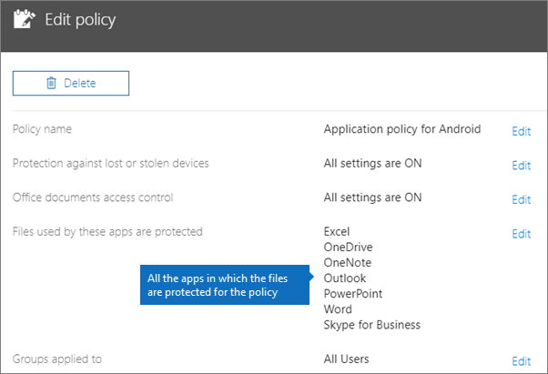
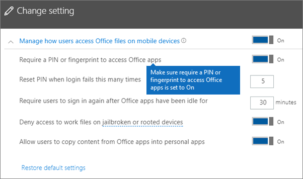
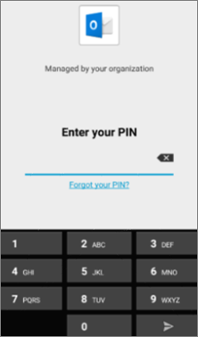
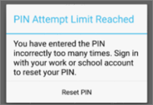
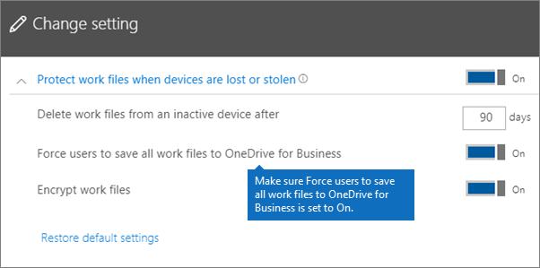
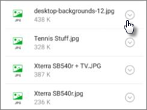
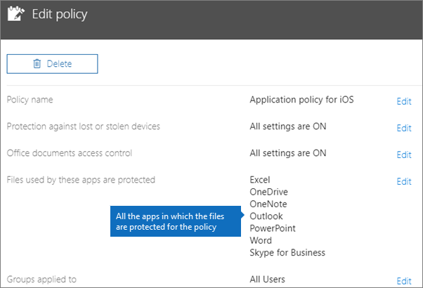
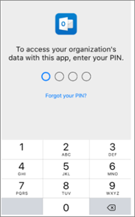
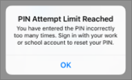

# Android veya iOS cihazlarda uygulama koruma ayarlarını doğrulamaValidate app protection settings on Android or iOS devices

Android veya iOS cihazlardaki uygulama koruma ayarlarını doğrulamak için aşağıdaki bölümlerdeki yönergeleri izleyin.Follow the instructions in the following sections to validate app protection settings on Android or iOS devices.
  
## AndroidAndroid
  
### Uygulama koruma ayarlarının kullanıcı aygıtlarında çalışıp çalışmadığını kontrol edinCheck that the app protection settings are working on user devices

Uygulamaları korumak amacıyla [Android cihazları için uygulama yapılandırmalarını ayarlayın](app-protection-settings-for-android-and-ios.md) ve seçtiğiniz ayarların çalıştığını doğrulamak için aşağıdaki adımları izleyin.After you [set app configurations for Android devices](app-protection-settings-for-android-and-ios.md) to protect the apps, you can follow these steps to validate that the settings you chose work. 
  
İlk olarak, politikanın doğruladığınız uygulama için geçerli olduğundan emin olun.First, make sure that the policy applies to the app in which you're going to validate it.
  
1. Microsoft 365 Business Premium [yönetici merkezinde,](https://portal.office.com) **İlkeler** \> **Edit ilkesine**gidin.In the Microsoft 365 Business Premium [admin center](https://portal.office.com), go to **Policies** \> **Edit policy**.
    
2. Kurulumda oluşturduğunuz ayarlar veya oluşturduğunuz başka bir ilke **için Android için Uygulama ilkesini** seçin ve örneğin Outlook için uygulandığını doğrulayın.Choose **Application policy for Android** for the settings you created at setup, or another policy you created, and verify that it's enforced for Outlook, for example. 
    
    
  
### Office uygulamalarına erişim için PIN veya parmak izi isteme doğrulamasıValidate Require a PIN or a fingerprint to access Office apps

**İlkeyi düzenle** bölmesinde **Office belgelerine erişim denetimi**'nin yanındaki **Düzenle**'yi seçin, **Kullanıcıların mobil cihazlardan Office dosyalarına erişimini yönet**'i genişletin ve **Office uygulamalarına erişim için PIN veya parmak izi iste** seçeneğinin **Açık** olduğundan emin olun.In the **Edit policy** pane, choose **Edit** next to **Office documents access control**, expand **Manage how users access Office files on mobile devices**, and make sure that **Require a PIN or fingerprint to access Office apps** is set to **On**.
  

  
1. Kullanıcının Android cihazında Outlook'u açın ve kullanıcının Microsoft 365 Business Premium kimlik bilgileriyle oturum açın.In the user's Android device, open Outlook and sign in with the user's Microsoft 365 Business Premium credentials.
    
2. Ayrıca pin girmeniz veya parmak izi kullanmanız istenir.You'll also be prompted to enter a PIN or use a fingerprint.
    
    
  
### Birkaç başarısız girişimden sonra PIN sıfırlama doğrulamasıValidate Reset PIN after number of failed attempts

**Edit ilkesi** bölmesinde, **Office belgelerinin yanındaki Edit'i seçin,** kullanıcıların mobil **cihazlardaki Office dosyalarına nasıl erişeceğini yönet'i**genişletin ve başarısız deneme sayısı belirlendikten **sonra PIN'i sıfırlamanın** bir sayıya ayarlandıklarından emin olun. **Edit**In the **Edit policy** pane, choose **Edit** next to **Office documents access control**, expand **Manage how users access Office files on mobile devices**, and make sure that **Reset PIN after number of failed attempts** is set to some number. Bu varsayılan olarak 5'tir.This is 5 by default. 
  
1. Kullanıcının Android cihazında Outlook'u açın ve kullanıcının Microsoft 365 Business Premium kimlik bilgileriyle oturum açın.In the user's Android device, open Outlook and sign in with the user's Microsoft 365 Business Premium credentials.
    
2. İlke tarafından belirtilen sayıda yanlış PIN girin.Enter an incorrect PIN as many times as specified by the policy. PIN'i sıfırlamak için **PIN Girişimi Sınırı'na Ulaşılan** bir istem görürsünüz.You'll see a prompt that states **PIN Attempt Limit Reached** to reset the PIN. 
    
    
  
3. **PIN'i Sıfırla**'ya basın.Press **Reset PIN**. Kullanıcının Microsoft 365 Business Premium kimlik bilgileriyle oturum açmanız istenir ve ardından yeni bir PIN ayarlamanız gerekir.You'll be prompted to sign in with the user's Microsoft 365 Business Premium credentials, and then required to set a new PIN.
    
### Kullanıcıları, tüm çalışma dosyalarını OneDrive İş'e kaydetmeye zorlama doğrulamasıValidate Force users to save all work files to OneDrive for Business

**İlkeyi düzenle** bölmesinde **Kaybolmuş veya çalınmış cihaz koruması**'nın yanındaki **Düzenle**'yi seçin, **Cihaz kaybolursa veya çalınırsa çalışma dosyalarını koru**'yu genişletin ve **Kullanıcıları, tüm çalışma dosyalarını OneDrive İş'e kaydetmeye zorla** seçeneğinin **Açık** olduğundan emin olun.In the **Edit policy** pane, choose **Edit** next to **Protection against lost or stolen devices**, expand **Protect work files when devices are lost or stolen**, and make sure that **Force users to save all work files to OneDrive for Business** is set to **On**.
  

  
1. Kullanıcının Android cihazında Outlook'u açın ve kullanıcının Microsoft 365 Business Premium kimlik bilgileriyle oturum açın ve istenirse bir PIN girin.In the user's Android device, open Outlook and sign in with the user's Microsoft 365 Business Premium credentials, and enter a PIN if requested.
    
2. Eki olan bir e-posta açın ve ekin bilgilerinin yanındaki aşağı ok simgesine dokunun.Open an email that contains an attachment and tap the down arrow icon next to the attachment's information.
    
    
  
    Ekranın alt kısmında **cihaza kaydedemezsiniz** göreceksiniz.You'll see **Cannot save to device** on the bottom of the screen. 
    
    
  
    > [!NOTE]
    > Şu anda Android için OneDrive İş'e kaydetme etkinleştirilmemiştir; dolayısıyla, yalnızca yerel olarak kaydetmenin engellendiğini görebilirsiniz.Saving to OneDrive for Business is not enabled for Android at this time, so you can only see that saving locally is blocked. 
  
### Office uygulamaları şu kadar süre boşta kalırsa kullanıcıların yeniden oturum açmasını isteme doğrulamasıValidate Require user to sign in again if Office apps have been idle for a specified time

**Edit ilkesi** bölmesinde, **Office belgelerinin yanındaki Edit'i seçin,** kullanıcıların mobil **cihazlardaki Office dosyalarına nasıl erişeceğini yönetin**ve Office uygulamaları boşta kaldıktan **sonra kullanıcıların oturum açmalarını zorunlu** kıldığından emin olun. **Edit**In the **Edit policy** pane, choose **Edit** next to **Office documents access control**, expand **Manage how users access Office files on mobile devices**, and make sure that **Require users to sign in again after Office apps have been idle for** is set to some number of minutes. Bu varsayılan olarak 30 dakikadır.This is 30 minutes by default. 
  
1. Kullanıcının Android cihazında Outlook'u açın ve kullanıcının Microsoft 365 Business Premium kimlik bilgileriyle oturum açın ve istenirse bir PIN girin.In the user's Android device, open Outlook and sign in with the user's Microsoft 365 Business Premium credentials, and enter a PIN if requested.
    
2. Şimdi Outlook gelen kutusunu görüyor olmalısınız. Android cihazına en az 30 dakika (veya ilkede belirttiğinizden daha uzun bir süre) boyunca dokunmayın ve boşta beklemesini sağlayın. Cihaz büyük olasılıkla kararacaktır.You should now see Outlook's inbox. Let the Android device idle untouched for at least 30 minutes (or some other amount of time, longer than what you specified in the policy). The device will likely dim.
    
3. Outlook'a Android cihazda yeniden erişin.Access Outlook on the Android device again.
    
4. Outlook'a yeniden erişemeden önce PIN'inizi girmeniz istenir.You'll be prompted to enter your PIN before you can access Outlook again.
    
### Şifreli çalışma dosyalarını koruma doğrulamasıValidate Protect work files with encryption

**İlkeyi düzenle** bölmesinde **Kaybolmuş veya çalınmış cihaz koruması**'nın yanındaki **Düzenle**'yi seçin, **Cihaz kaybolursa veya çalınırsa çalışma dosyalarını koru**'yu genişletin ve **Şifreli çalışma dosyalarını koru** seçeneğinin **Açık**, **Kullanıcıları, tüm çalışma dosyalarını OneDrive İş'e kaydetmeye zorla** seçeneğinin **Kapalı** olarak ayarlandığından emin olun.In the **Edit policy** pane, choose **Edit** next to **Protection against lost or stolen devices**, expand **Protect work files when devices are lost or stolen**, and make sure that **Protect work files with encryption** is set to **On**, and **Force users to save all work files to OneDrive for Business** is set to **Off**.
  
1. Kullanıcının Android cihazında Outlook'u açın ve kullanıcının Microsoft 365 Business Premium kimlik bilgileriyle oturum açın ve istenirse bir PIN girin.In the user's Android device, open Outlook and sign in with the user's Microsoft 365 Business Premium credentials, and enter a PIN if requested.
    
2. Birkaç resim dosyası ekleri içeren bir e-posta açın.Open an email that contains a few image file attachments.
    
3. Kaydetmek için ekin bilgilerinin yanındaki aşağı ok simgesine dokunun.Tap the down arrow icon next to the attachment's info to save it.
    
    
  
4. Outlook'un cihazınızdaki fotoğraflara, medyaya ve dosyalara erişmesine izin vermeniz istenebilir. **İzin Ver**'e dokunun.You may be prompted to allow Outlook to access photos, media, and files on your device. Tap **Allow**.
    
5. Ekranın en altında, **Cihaza Kaydet**'i seçin ve ardından **Galeri** uygulamasını açın.At the bottom of the screen, choose to **Save to Device** and then open the **Gallery** app. 
    
6. Listede şifrelenmiş bir fotoğraf (birden çok resim dosyası eki kaydettiyseniz daha fazla olabilir) görüyor olmalısınız. Resimler listesinde, ortasında beyaz bir dairenin içinde beyaz bir ünlem işareti bulunan gri bir kare olarak gösteriliyor olabilir.You should see an encrypted photo (or more, if you saved multiple image file attachments) in the list. It may appear in the Pictures list as a gray square with a white exclamation point within a white circle in the center of the gray square.
    
    
  
## IosiOS
  
### Uygulama koruma ayarlarının kullanıcı cihazlarında çalışıp çalışmadığını denetlemeCheck that the App protection settings are working on user devices

Uygulamaları korumak amacıyla [iOS cihazları için uygulama yapılandırmalarını ayarlayın](app-protection-settings-for-android-and-ios.md) ve seçtiğiniz ayarların çalıştığını doğrulamak için aşağıdaki adımları izleyin.After you [set app configurations for iOS devices](app-protection-settings-for-android-and-ios.md) to protect apps, you can follow these steps to validate that the settings you chose work. 
  
İlk olarak, politikanın doğruladığınız uygulama için geçerli olduğundan emin olun.First, make sure that the policy applies to the app in which you're going to validate it.
  
1. Microsoft 365 Business Premium [yönetici merkezinde,](https://portal.office.com) **İlkeler** \> **Edit ilkesine**gidin.In the Microsoft 365 Business Premium [admin center](https://portal.office.com), go to **Policies** \> **Edit policy**.
    
2. Kurulumda oluşturduğunuz ayarlar veya oluşturduğunuz başka bir ilke için iOS için **Uygulama ilkesini** seçin ve örneğin Outlook için uygulandığını doğrulayın.Choose **Application policy for iOS** for the settings you created at setup, or another policy you created, and verify that it's enforced for Outlook for example. 
    
    
  
### Office uygulamalarına erişmek için PIN istemeyi doğrulamaValidate Require a PIN to access Office apps

**İlkeyi düzenle** bölmesinde **Office belgelerine erişim denetimi**'nin yanındaki **Düzenle**'yi seçin, **Kullanıcıların mobil cihazlardan Office dosyalarına erişimini yönet**'i genişletin ve **Office uygulamalarına erişim için PIN veya parmak izi iste** seçeneğinin **Açık** olduğundan emin olun.In the **Edit policy** pane, choose **Edit** next to **Office documents access control**, expand **Manage how users access Office files on mobile devices**, and make sure that **Require a PIN or fingerprint to access Office apps** is set to **On**.
  

  
1. Kullanıcının iOS aygıtında Outlook'u açın ve kullanıcının Microsoft 365 Business Premium kimlik bilgileriyle oturum açın.In the user's iOS device, open Outlook and sign in with the user's Microsoft 365 Business Premium credentials.
    
2. Ayrıca pin girmeniz veya parmak izi kullanmanız istenir.You'll also be prompted to enter a PIN or use a fingerprint.
    
    
  
### Birkaç başarısız girişimden sonra PIN sıfırlama doğrulamasıValidate Reset PIN after number of failed attempts

**Edit ilkesi** bölmesinde, **Office belgelerinin yanındaki Edit'i seçin,** kullanıcıların mobil **cihazlardaki Office dosyalarına nasıl erişeceğini yönet'i**genişletin ve başarısız deneme sayısı belirlendikten **sonra PIN'i sıfırlamanın** bir sayıya ayarlandıklarından emin olun. **Edit**In the **Edit policy** pane, choose **Edit** next to **Office documents access control**, expand **Manage how users access Office files on mobile devices**, and make sure that **Reset PIN after number of failed attempts** is set to some number. Bu varsayılan olarak 5'tir.This is 5 by default. 
  
1. Kullanıcının iOS aygıtında Outlook'u açın ve kullanıcının Microsoft 365 Business Premium kimlik bilgileriyle oturum açın.In the user's iOS device, open Outlook and sign in with the user's Microsoft 365 Business Premium credentials.
    
2. İlke tarafından belirtilen sayıda yanlış PIN girin.Enter an incorrect PIN as many times as specified by the policy. PIN'i sıfırlamak için **PIN Girişimi Sınırı'na Ulaşılan** bir istem görürsünüz.You'll see a prompt that states **PIN Attempt Limit Reached** to reset the PIN. 
    
    
  
3. **Tamam**'a basın.Press **OK**. Kullanıcının Microsoft 365 Business Premium kimlik bilgileriyle oturum açmanız istenir ve ardından yeni bir PIN ayarlamanız gerekir.You'll be prompted to sign in with the user's Microsoft 365 Business Premium credentials, and then required to set a new PIN.
    
### Kullanıcıları, tüm çalışma dosyalarını OneDrive İş'e kaydetmeye zorlama doğrulamasıValidate Force users to save all work files to OneDrive for Business

**İlkeyi düzenle** bölmesinde **Kaybolmuş veya çalınmış cihaz koruması**'nın yanındaki **Düzenle**'yi seçin, **Cihaz kaybolursa veya çalınırsa çalışma dosyalarını koru**'yu genişletin ve **Kullanıcıları, tüm çalışma dosyalarını OneDrive İş'e kaydetmeye zorla** seçeneğinin **Açık** olduğundan emin olun.In the **Edit policy** pane, choose **Edit** next to **Protection against lost or stolen devices**, expand **Protect work files when devices are lost or stolen**, and make sure that **Force users to save all work files to OneDrive for Business** is set to **On**.
  

  
1. Kullanıcının iOS aygıtında Outlook'u açın ve kullanıcının Microsoft 365 Business Premium kimlik bilgileriyle oturum açın ve istenirse bir PIN girin.In the user's iOS device, open Outlook and sign in with the user's Microsoft 365 Business Premium credentials, and enter a PIN if requested.
    
2. Ek içeren bir e-postayı açın ve eki açıp ekranın altındaki **Kaydet**'i seçin.Open an email that contains an attachment, open the attachment and choose **Save** on the bottom of the screen. 
    
    
  
3. OneDrive İş için yalnızca bir seçenek görüyor olmanız gerekir.You should only see an option for OneDrive for Business. Değilse, **Hesap Ekle'ye** dokunun ve **Depolama Hesabı Ekle** ekranından İşletmeler için **OneDrive'ı** seçin.If not, tap **Add Account** and select **OneDrive for Business** from the **Add Storage Account** screen. İstendiğinde oturum açması için son kullanıcının Microsoft 365 Business Premium'una olanak sağlayın.Provide the end user's Microsoft 365 Business Premium to sign in when prompted. 
    
    **Kaydet**'e tıklayıp **OneDrive İş**'i seçin.Tap **Save** and select **OneDrive for Business**.
    
### Office uygulamaları belirli bir süre boyunca boşta kalırsa kullanıcının tekrardan oturum açmasını istemeyi doğrulamaValidate Require user to sign in again if Office apps have been idle for a specified time

**Edit ilkesi** bölmesinde, **Office belgelerinin yanındaki Edit'i seçin,** kullanıcıların mobil **cihazlardaki Office dosyalarına nasıl erişeceğini yönetin**ve Office uygulamaları boşta kaldıktan **sonra kullanıcıların oturum açmalarını zorunlu** kıldığından emin olun. **Edit**In the **Edit policy** pane, choose **Edit** next to **Office documents access control**, expand **Manage how users access Office files on mobile devices**, and make sure that **Require users to sign in again after Office apps have been idle for** is set to some number of minutes. Bu varsayılan olarak 30 dakikadır.This is 30 minutes by default. 
  
1. Kullanıcının iOS aygıtında Outlook'u açın ve kullanıcının Microsoft 365 Business Premium kimlik bilgileriyle oturum açın ve istenirse bir PIN girin.In the user's iOS device, open Outlook and sign in with the user's Microsoft 365 Business Premium credentials, and enter a PIN if requested.
    
2. Şimdi Outlook gelen kutusunu görüyor olmanız gerekir. iOS cihazına en az 30 dakika (veya ilkede belirttiğinizden daha uzun bir süre) boyunca dokunmayın. Cihaz büyük olasılıkla kararır.You should now see Outlook's inbox. Let the iOS device untouched for at least 30 minutes (or some other amount of time, longer than what you specified in the policy). The device will likely dim.
    
3. iOS aygıtında Outlook'a yeniden erişin.Access Outlook on the iOS device again.
    
4. Outlook'a yeniden erişemeden önce PIN'inizi girmeniz istenir.You'll be prompted to enter your PIN before you can access Outlook again.
    
### Şifreli çalışma dosyalarını koruma doğrulamasıValidate Protect work files with encryption

**İlkeyi düzenle** bölmesinde **Kaybolmuş veya çalınmış cihaz koruması**'nın yanındaki **Düzenle**'yi seçin, **Cihaz kaybolursa veya çalınırsa çalışma dosyalarını koru**'yu genişletin ve **Şifreli çalışma dosyalarını koru** seçeneğinin **Açık**, **Kullanıcıları, tüm çalışma dosyalarını OneDrive İş'e kaydetmeye zorla** seçeneğinin **Kapalı** olarak ayarlandığından emin olun.In the **Edit policy** pane, choose **Edit** next to **Protection against lost or stolen devices**, expand **Protect work files when devices are lost or stolen**, and make sure that **Protect work files with encryption** is set to **On**, and **Force users to save all work files to OneDrive for Business** is set to **Off**.
  
1. Kullanıcının iOS aygıtında Outlook'u açın ve kullanıcının Microsoft 365 Business Premium kimlik bilgileriyle oturum açın ve istenirse bir PIN girin.In the user's iOS device, open Outlook and sign in with the user's Microsoft 365 Business Premium credentials, and enter a PIN if requested.
    
2. Birkaç resim dosyası ekleri içeren bir e-posta açın.Open an email that contains a few image file attachments.
    
3. Eke dokunun ve sonrasında altındaki **Kaydet** seçeneğine dokunun.Tap the attachment and then tap the **Save** option under it. 
    
4. Giriş ekranından **Fotoğraflar** uygulamasını açın. Şifreli bir resmin (birden çok resim dosyası eki kaydettiyseniz daha fazla olabilir) kaydedildiğini, ancak şifrelenmiş olduğunu görürsünüz.Open **Photos** app from the home screen. You should see an encrypted photo (or more, if you saved multiple image file attachments) saved, but encrypted. 
    
---

