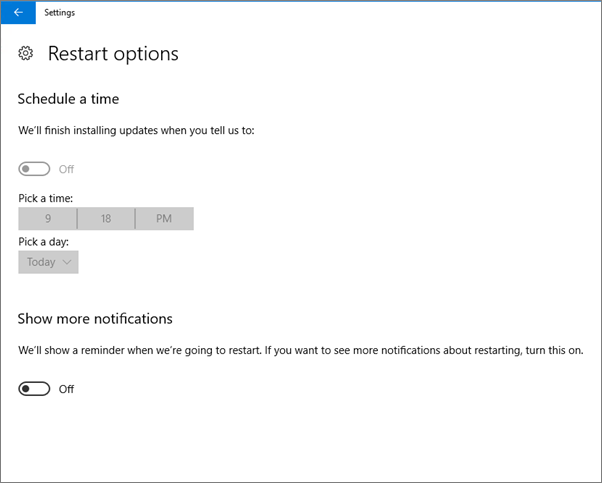
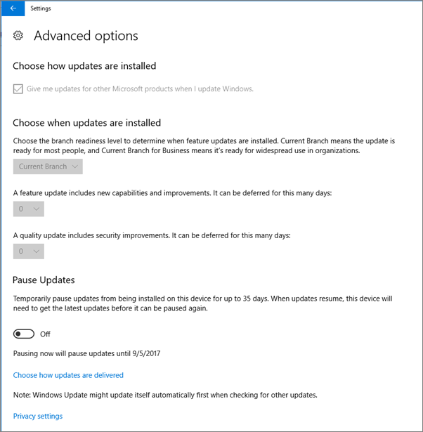
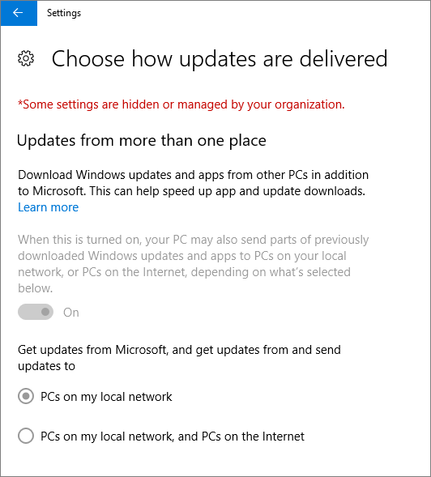
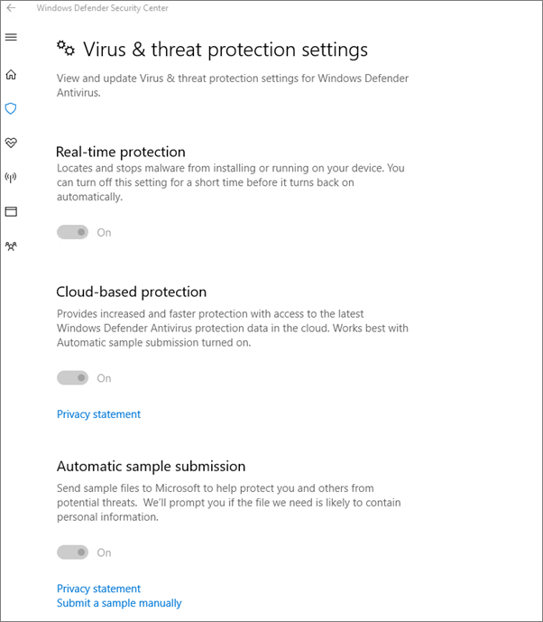

# Windows 10 bilgisayarlarda cihaz koruma ayarlarını doğrulama

## Windows 10 cihaz ilkelerinin ayar olduğunu doğrulama

Cihaz [ilkelerini ayardikten](protection-settings-for-windows-10-pcs.md)sonra, ilkenin kullanıcıların cihazlarında etkili olarak yer almaları birkaç saat kadar sürebilir. İlkelerin, kullanıcıların cihazlarında çeşitli Windows Ayarları ekranlarına bakarak etkili olduğunu onaylayın. Kullanıcılar Windows 10 cihazlarında Windows Update ve Windows Defender Virüsten Koruma ayarlarını değiştiremayacaklarından, birçok seçenek gri görünür.
  
1. Ayarlar  \> **Güncelleştirmesi &amp; güvenlik** \> **Windows Update Yeniden** Başlatma \> **seçeneklerine** gidin ve tüm ayarların gri renkte görüntüde olduğunu onaylayın. 
    
    
  
2. Ayarlar  \> **Güncelleştirmesi &amp; güvenliği** \> **Windows Update Gelişmiş** \> **seçeneklerine** gidin ve tüm ayarların gri olduğunu onaylayın. 
    
    
  
3. Ayarlar **Güncelleştirmesi** \> **güvenliği Windows Update &amp;** \> **Gelişmiş seçeneklerine** gidin \>  \> **Güncelleştirmelerin nasıl teslim alınarak teslim edileceklerini seçin.**
    
    Bazı ayarların kuruluş tarafından gizlenmiş veya yönetiliyor olduğunu ve tüm seçeneklerin gri renkte olduğunu (kırmızı renkle) gördüğünüzden emin olun.
    
    
  
4. Windows Defender Güvenlik Merkezi'ne  gitmek için Windows Defender'ın Ayarlar Güncelleştirmesi güvenliğine gidin, Windows Defender Güvenlik Merkezi Virüs iş parçacığı koruması Virüs tehdit koruması ayarlarını \> **&amp;** \>  \>  \> **&amp;** \> **&amp; aç'a tıklayın.** 
    
5. Tüm seçeneklerin gri renkte olduğunu doğrulayın. 
    
    
  
## İlgili Konular

[İşletmeler için Microsoft 365 belgeleri ve kaynakları](./index.yml)
  
[Microsoft 365 İş ile çalışmaya başlama](microsoft-365-business-overview.md)
  
[Microsoft 365 İş'i yönetme](manage.md)
  
[Windows 10 bilgisayarlarında cihaz yapılandırmalarını ayarlama](protection-settings-for-windows-10-pcs.md)
