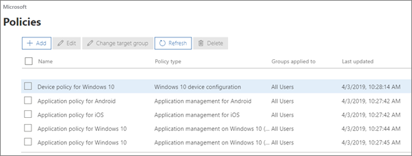
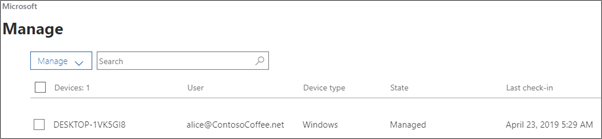

# İlkeleri ve cihazları görüntüleme ve yönetmeView and manage policies and devices

## Aygıt ilkelerini görüntüleme ve görüntülemeView and edit device policies

1.  'deki <a href="https://go.microsoft.com/fwlink/p/?linkid=837890" target="_blank">https://admin.microsoft.com</a>yönetici merkezine gidin.Go to the admin center at <a href="https://go.microsoft.com/fwlink/p/?linkid=837890" target="_blank">https://admin.microsoft.com</a>.
2. Sol daki gezinmede **Aygıt** \> **İlkeleri'ni**seçin.On the left nav, choose **Devices** \> **Policies**.

    Bu sayfada, hedef grup oluşturabilir, düzenleyebilir, değiştirebilir veya bir ilke silebilirsiniz.On this page, you can create, edit, change target group, or delete a policy.

    
  
## Cihazları görüntüleme ve yönetmeView and manage devices

1. Sol daki gezinmede, **Aygıtları** \> **Yönet'i**seçin.On the left nav, choose **Devices** \> **Manage**. 
    
    Bu sayfada, bir veya daha fazla aygıt seçebilir ve şirket verilerini kaldırabilirsiniz.On this page, you can select one or more devices and remove company data. Cihaz koruma ayarlarını yaptığınız Windows 10 cihazlarında, cihazı fabrika ayarlarına sıfırlamayı da seçebilirsiniz.For Windows 10 devices that you have set device protections settings for, you can also choose to reset the device to factory settings.
  
   

